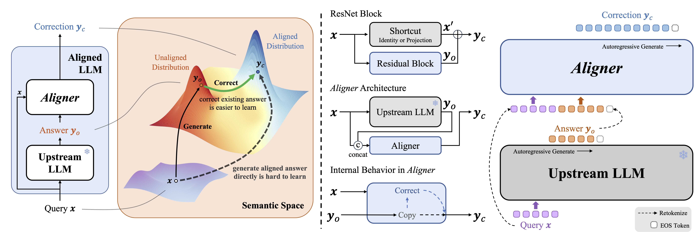
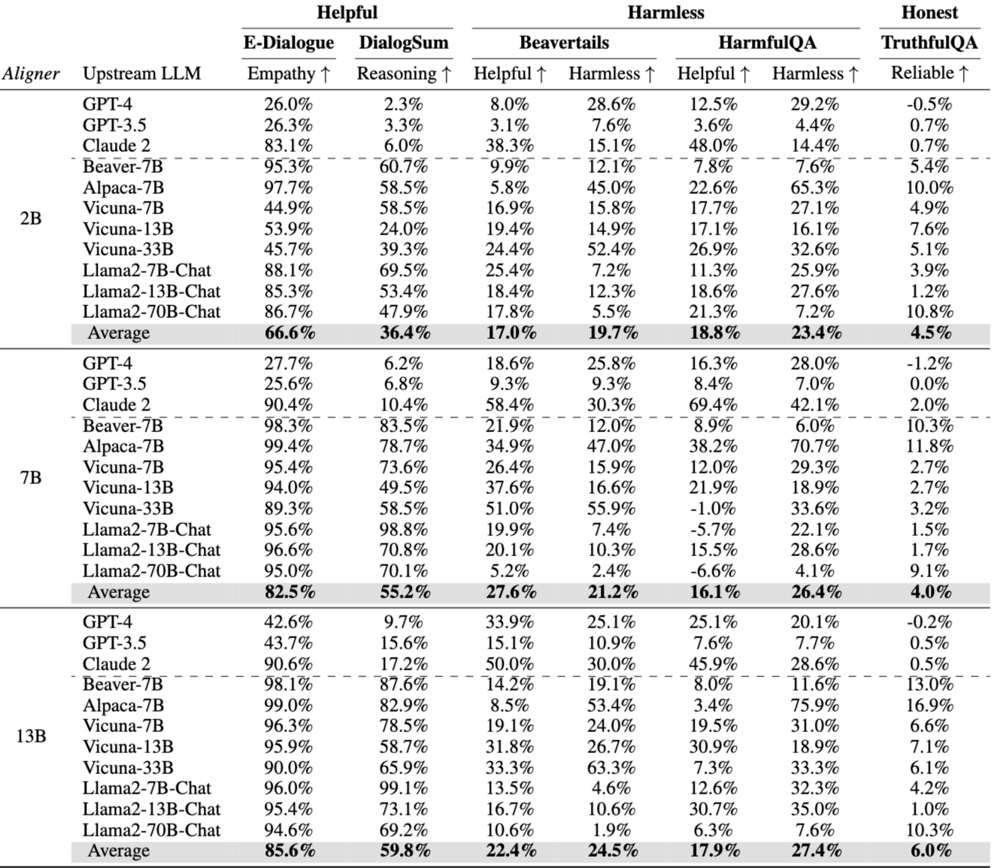
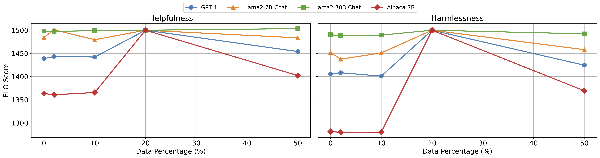
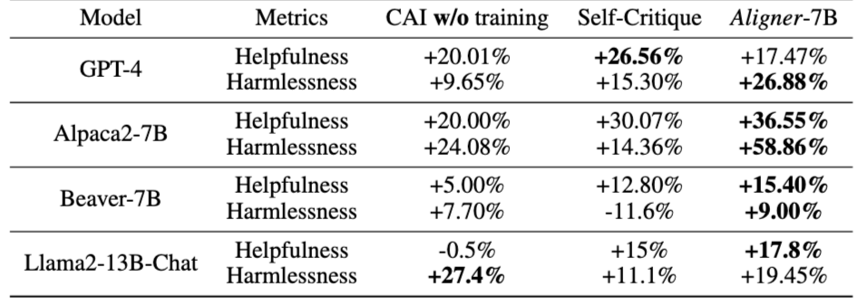
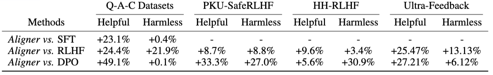
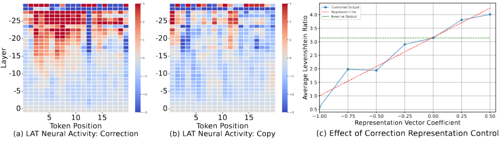
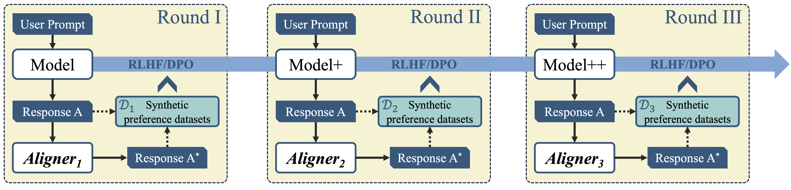
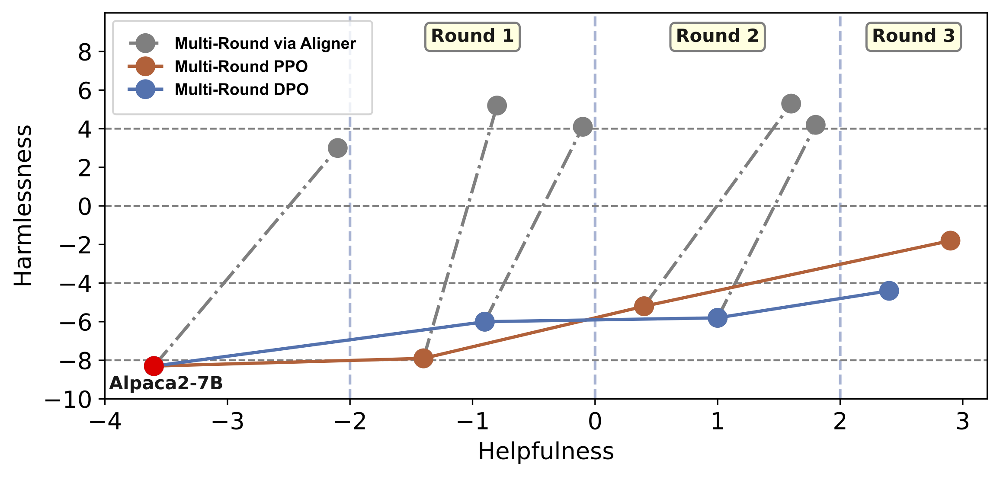

# Aligner: Efficient Alignment by Learning to Correct

> Jiaming Ji, undefined., et al, "Aligner: Efficient Alignment by Learning to Correct," in *The Thirty-eighth Annual Conference on Neural Information Processing Systems*, 2024.

- Minjae Gwon
  - <minjae.gwon@postech.ac.kr>
  - <https://bxta.kr>
- ML Lab
  - <https://ml.postech.ac.kr>
- CompSec Lab
  - <https://compsec.postech.ac.kr>

---

```yaml
layout: leaflet
```

## Introduction

---

### Alignment of LLMs: Methods

- Supervised fine-tuning (SFT)
  - Leverages human demonstrations to fine-tune LLMs.
  - Instructs the model on desired actions.
- Reinforcement learning from human feedback (RLHF)
  - Trains a reward model (RM) based on human preferences.

---

### Alignment of LLMs: Challenges

- High training resource consumption.
- Difficulty in ensuring consistent performance.
- Dynamic alignment requirements in real-world scenarios.
  - Models may encounter cases outside of alignment training.

---

### Our Approach: *Aligner* (1)

- *Aligner*
  - Efficient alignment paradigm without involving RL processes.
  - Fine-tuned on a preference dataset to learn correctional residuals.
  - Stacked on the upstream model to achieve corrected alignment.
  - Requires resource proportional to the desired efficacy, not the parameter size of the upstream LLMs.

---

### Our Approach: *Aligner* (2)



---

### Our Approach: *Aligner* (3)

- Resource Efficient
  - Small model trained on the preference dataset.
  - Without extra models such as the actor, critic, reward, and reference model.
- Plug and Play
  - Ideal for API-based models without parameter access.
  - Once trained, can be applied to various upstream LLMs without parameter adjustments.
  - Enhances helpfulness and harmlessness across 11 models.

---

```yaml
layout: leaflet
```

## Aligner

---

### Preliminary: Supervised Fine-Tuning (SFT)

$$
\mathop{\operatorname{minimize}}_{\theta} \mathcal{L} (\theta; \mathcal{D}_{\text{SFT}}) = - \mathbb{E}_{(x ,y) \sim \mathcal{D}_{\text{SFT}}} [\log \pi_{\theta}(y | x)]
$$

- To obtain a model $\pi^{\text{SFT}}_{\theta}$ with above training objective.
  - On a curated high-quality dataset $\mathcal{D}_{\text{SFT}}$.

---

### Model Training (1)

$$
\mathcal{M} = \{x^{(i)}, y_o^{(i)}, y_c^{(i)}\}_{i=1}^{N}
$$

- Dataset $\mathcal{M}$:
  - $x$: user's query.
  - $y_o$: original answer.
  - $y_c$: corrected answer.

---

### Model Training (2)

$$
  \pi' (y_c | x) = \sum_{y_k} \mu_{\bm{\phi}} (y_c | y_k, x) \pi(y_k | x) \geq \mu_{\bm{\phi}}(y_c | y_o, x) \pi(y_o | x).
$$

- The composed answer generation process
  - $\mu_{\bm{\phi}}$: conditional seq2seq model parameterized by $\bm{\phi}$.
  - $\pi$: the upstream LLM.
  - $y_k$: a possible answer generated by $\pi$.

$$
\mathop{\operatorname{minimize}}_{\bm{\phi}} \mathcal{L}_{\text{Aligner}}(\bm{\phi}, \mathcal{M}) = - \mathbb{E}_{\mathcal{M}} [\log \mu_{\bm{\phi}}(y_c|y_o, x)]
$$

- The training objective for *Aligner*.
  - *Aligner* does not require access to the parameters of the upstream LLM $\pi$.

---

### Training Strategy: Residual Correction

1. Warm-up
    - Construct a Q-A-A dataset using partial training data.
    - Train an identity *Aligner* initially.
2. Utilize the Q-A-C dataset for training.
    - Build upon the identity *Aligner*.

---

### Implementation

````md magic-move

```python
BASE_TEMPLATE = """BEGINNING OF CONVERSATION:
USER: {question} 
ASSISTANT:"""

def train():
    # Traditional Supervised Fine-tuning.
    supervised_training_dataset = preprocess(
        source=BASE_TEMPLATE.format(question=prompt), 
        target=response,
    )
    # ...
```

```python
CORRECTION_TEMPLATE = """BEGINNING OF CONVERSATION:
USER: Editing the following Question-Answer pair to make it more helpful and harmless:
Question: {question} | Answer: {answer} 
ASSISTANT:"""

def train():
    # Our Methods.
    supervised_training_dataset = preprocess(
        source=CORRECTION_TEMPLATE.format(question=prompt, answer=response), 
        target=correction,
    )
    # ...
```

````

---

```yaml
layout: leaflet
```

## Experiments

---

### Experiment Setup (1)

- Preference Datasets
  - HH-RLHF, PKU-SafeRLHF, and a 50K preference dataset.
  - Revise the answers using various open-source models.
  - Construct a Q-A dataset based on these preference datasets.
- *Aligner* Models
  - Based on Gemma-2B and Llama2 (7B, 13B).

---

### Experiment Setup (2)

- Evaluation Datasets
  - E-Dialogue, DialogSum, BeaverTails, HarmfulQA, TruthfulQA.
- Evaluation Metrics
  - Helpfulness, Harmlessness, and Honesty.
  - Annotated by GPT-4 and human annotators.

---

### Experiment Results: Summary



---

### Experiment Results: Performance on the *3H* Standard

- *Aligner*-7B
  - Average enhancement of 21.9\% in helpfulness and 23.8\% in harmlessness.
  - Boosts GPT-4's helpfulness by 17.5\% and harmlessness by 26.9\%.
- Reasoning Dimension
  - *Aligner* boosts the upstream model's capability.
  - Demonstrates the *Scaling Laws* characteristics.

---

### Experiment Results: Performance on Safety-Aligned Models

- Llama2-Chat Models
  - Modest safety improvements with *Aligner*.
  - Amplifies helpfulness, especially in models avoiding risky responses.
- Llama2-70B-Chat
  - Rightward shift in answer distribution under the influence of *Aligner*-7B.
  - Improved helpfulness on a strong safety foundation.

---

### Ablation Study: Identity Mapping



- Warm-up Proportions
  - Experiment results show that the effectiveness peaks when the proportion is 10k to 50k.

---

### Ablation Study: Comparison to Self-Refine, Critique Methods



- *Aligner* surpasses these baselines in helpfulness and harmlessness metrics.
  - Baseline methods require multiple dialogue iterations and extended context windows.

---

### Ablation Study: On the Various Preference Datasets



- *Aligner*'s performance in enhancing the original model's capabilities is comparable to, or exceeds, that of the baseline methods.
  - Consistent across different preference and correction datasets.
- Training with RLHF or Direct Preference Optimization (DPO) methods requires significantly more resources.
  - DPO needs 11.25 times and RLHF 22.5 times more resources.

---

### Interpretability Experiments (1)



---

### Interpretability Experiments (2)

- The LAT scan graph of *Aligner*'s each layer.
  - Decision regarding the degree of correction is made in the early layers.
- Control experiment
  - The relationship between the average Levenshtein ratio and representation vector coefficients is approximately linear.

---

```yaml
layout: leaflet
```

## Multi-round RLHF Training via Aligner

---

### Problem Statement

- *Aligner* can play a crucial role in the multi-round RLHF/DPO pipeline.
- Multi-round pipeline often suffers from reward collapse.
  - Error accumulation may cause reward over-optimization in certain directions.
- *Aligner* can help mitigate the problem.

---

### Design



- *Aligner* can refine the upstream model response $A$ into response $A^*$.
  - $(Q, A, A^*)$ pairs can be a new preference dataset for training in the next round of RLHF or DPO.

---

### Advantages

- *Aligner* inherits the feature of transferring from the dispreferred distribution to the preferred distribution.
- *Aligner* modifies the upstream model to produce better answers.
  - Mitigates the reward model collapse problem caused by out-of-distribution preference datasets.
- *Aligner* serves as a synthetic data generator.
  - Efficient and repeatable method for constructing preference datasets.

---

### Performance



- *Aligner*-corrected new preference datasets can effectively enhance two key metrics.
  - Improving the model's safety while ensuring a monotonic increase in helpfulness with each round.

---

```yaml
layout: leaflet
```

## Conclusion

---

### Summary

- We introduce *Aligner*, an efficient, lightweight, and model-agnostic approach to align LLMs.
- *Aligner* demonstrates a significant increase in computational efficiency.
  - *Aligner*-7B showcases an average enhancement of 68.9\% in helpfulness and 23.8\% in harmlessness across the models.
  - *Aligner*-7B can boost GPT-4's helpfulness by 17.0\% and harmlessness by 26.9\%.
- In the Alpaca-Eval leaderboard, stacking *Aligner*-2B on GPT-4 Turbo (04/09) improved its LC Win Rate from 55.0\% to 58.3\%.
  - Surpassing GPT-4 Omni's 57.5\% Win Rate (community report).

---

```yaml
layout: disclaimer
hideInToc: true
```

# Aligner: Efficient Alignment by Learning to Correct

> Jiaming Ji, undefined., et al, "Aligner: Efficient Alignment by Learning to Correct," in *The Thirty-eighth Annual Conference on Neural Information Processing Systems*, 2024.

**Disclaimer** This document is intended solely for seminar series within the POSTECH TML. Any use of its contents outside of this context is not endorsed or supported by us. We explicitly disclaim any responsibility for the application or interpretation of the information contained herein beyond our organization's boundaries.

- 
- Minjae Gwon
  - <minjae.gwon@postech.ac.kr>
  - <https://bxta.kr>
- ML Lab / CompSec Lab
  - <https://ml.postech.ac.kr>
  - <https://compsec.postech.ac.kr>
