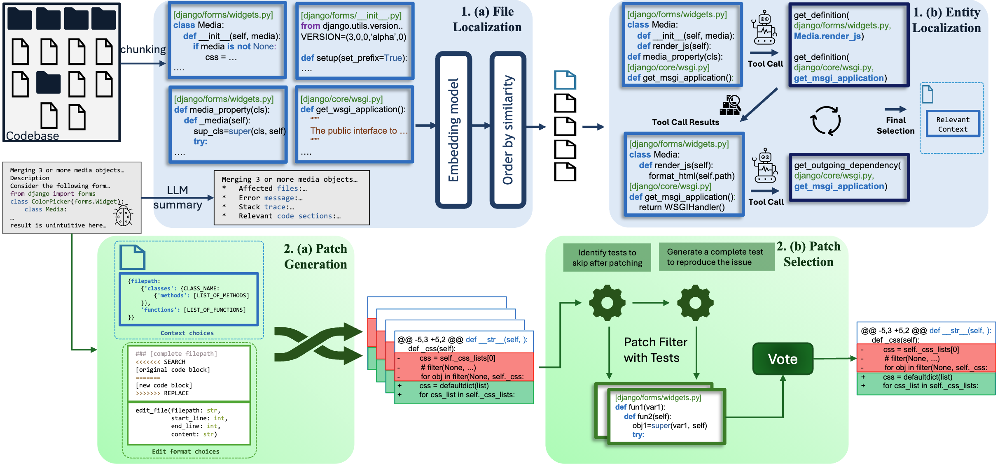
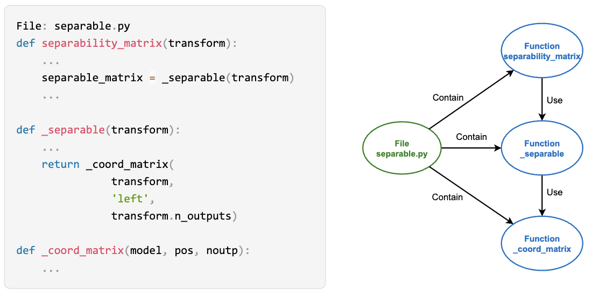
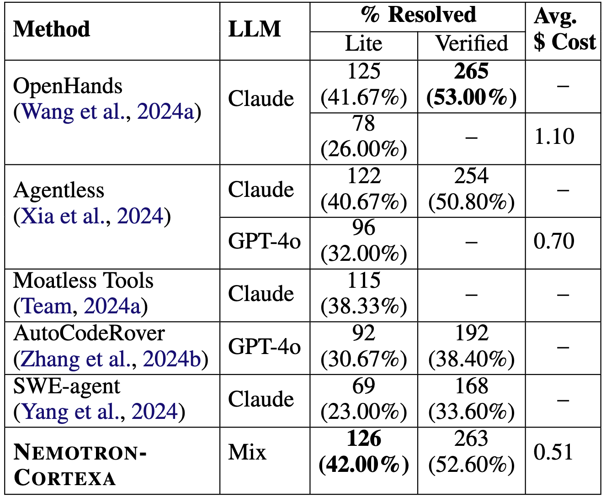
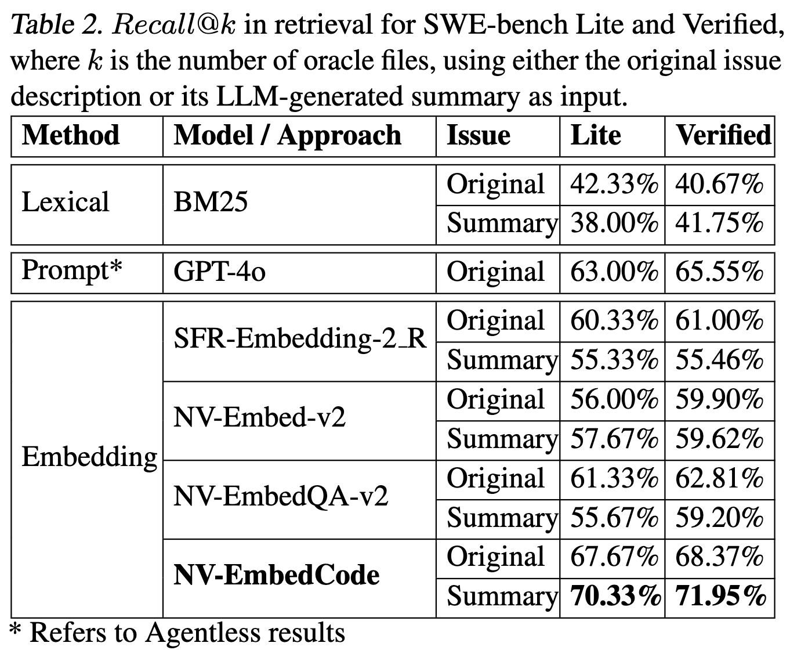
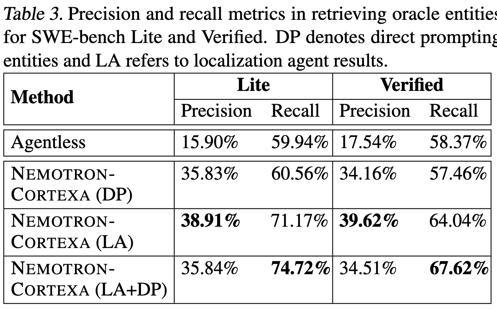
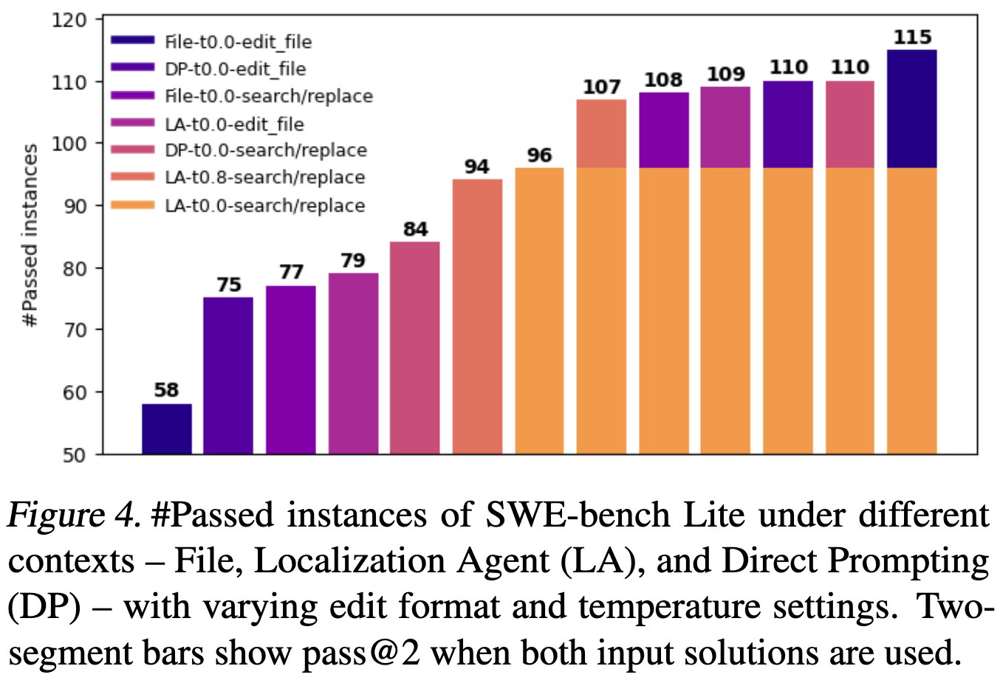
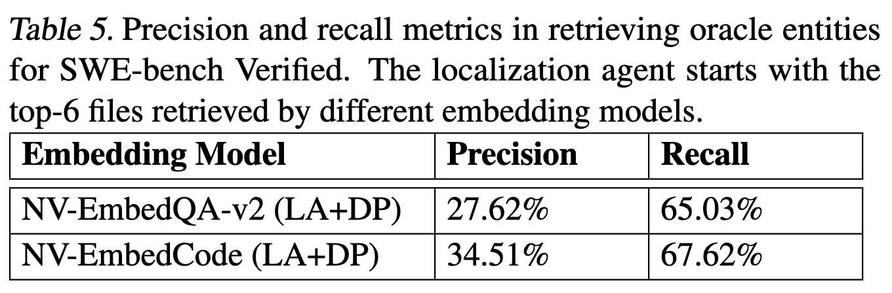

# Nemotron-CORTEXA: Enhancing LLM Agents for Software Engineering Tasks via Improved Localization and Solution Diversity

> Sohrabizadeh, A., Song, J., Liu, M., Roy, R., Lee, C., Raiman, J., & Catanzaro, B. (2025). Nemotron-CORTEXA: Enhancing LLM Agents for Software Engineering Tasks via Improved Localization and Solution Diversity. Forty-Second International Conference on Machine Learning.

- Minjae Gwon
  - <minjae.gwon@postech.ac.kr>
  - <https://bxta.kr>
- ML Lab
  - <https://ml.postech.ac.kr>
- CompSec Lab
  - <https://compsec.postech.ac.kr>

---

```yaml
layout: leaflet
```

## Introduction

---

### Background

- Recent research focuses on LLM coding agents that handle full software engineering tasks using tools like CLI and IDE.
- SWE-bench is a key benchmark for evaluating LLM agents on real-world GitHub issues.
  - Rapid progress on SWE-bench demonstrates the potential of LLM agents to automate software engineering.
  - This work aims to further improve the efficiency and accuracy of LLM agents using SWE-bench as a benchmark.

---

### Contributions

- Develop a code embedding model.
  - Specialized in retrieving relevant code chunks to a given bug.
- Designed a localization agent.
  - Integrates advanced programming tools and leverages an ensemble of LLMs to deliver more precise and granular issue localization.
- Propose a diverse solution generation method.
  - Leverages different contextual information and varied prompt formats, significantly enhancing sample efficiency.

---

```yaml
layout: leaflet
```

## Nemotron-CORTEXA

---

### Overview of the Pipeline (1)



---

### Overview of the Pipeline (2)

1. First stage: Localization
    1. Identify the most relevant files based on the issue description.
    2. Refine the granularity of the retrieval to focus on specific functions, classes, or methods.
2. Second stage: Repair
    1. Combine different contexts and prompts to increase patch diversity.
    2. Filter the generated patches to select the most promising one.

---

### File Localization: Problem Statement

- General embedding models perform worse than prompt-based methods for file localization.
- Prompt-based methods also have limitations:
  - LLMs often rely only on file names, reducing localization accuracy.
  - LLMs may depend on prior knowledge of specific repositories.
- Providing the full contents of all files to LLMs is computationally infeasible due to high resource costs.

---

### File Localization: Solution

- Propose a coding embedding model, NV-EmbedCode.
  - To retrieve relevant files based on issue descriptions.
  - Fine-tuned from an existing text-based embedding model.

---

### File Localization: Dataset

- Curate a dataset mapping issues to code edits.
  - Chunk large files and prefix each chunk with meta-information.
    - e.g., full file path.
- Create a second dataset with concise summaries of issue descriptions.
  - Due to potential redundancy or insufficient details in issue descriptions.
  - Summaries include relevant information like filenames, functions, error messages, and stack traces.

---

### File Localization: Training

- Train NV-EmbedCode using a contrastive learning objective.
  - Maximize similarity between issue descriptions and relevant code chunks.
  - Minimize similarity to irrelevant code chunks.

---

### Entity Localization: Problem Statement

- Next step after file localization is to identify specific entities.
  - Entities include classes, functions, and methods within the files.
  - The full texts of localized files often exceed the context window of LLMs.

---

### Entity Localization: Solution

- Develop a localization agent that iteratively explores the repository.
  - Inspired by information foraging theory in software debugging.

---

### Entity Localization: Graph Representation

- Build a graph representation of the repository.
  - Nodes represent code files and entities (functions, classes, methods).
  - Directed edges represent hierarchical relationships (contain) and functional dependencies (use).



---

### Entity Localization: Tools for Navigation

- Equip the localization agent with tools to navigate the graph.
  - Similar to features in popular IDEs like Go To Definition and Call Hierarchy.
  - Implemented using an LSP (Language Server Protocol) server.
- Tools include:
  - `get_definition(file_name, entity_name)`
    - Returns the code definition of the specified entity in the requested file.
  - `get_incoming_dependency(file_name, entity_name)`
    - Returns the definition codes of the specified entity’s source nodes using its incoming edges.
  - `get_outgoing_dependency(file_name, entity_name)`
    - Returns the definition codes of the specified entity’s destination nodes using its outgoing edges.

---

### Entity Localization: Iterative Exploration

- The localization agent operates as follows:
    1. Begins with the top-ranked files identified by the code embedding model.
    2. Summarizes high-level entities (such as functions, classes, and methods) within these files.
    3. Uses the issue description to pinpoint entities likely related to the problem.
    4. Examines the full code of selected entities and leverages navigation tools to explore related entities.
    5. Stores newly retrieved code snippets in its context for subsequent queries.
    6. Iteratively interacts with the repository to accumulate relevant context.
    7. Filters and maintains only the most pertinent snippets in a memory buffer to prevent context overload.
    8. After several iterations, determines the final set of entities that need modification to resolve the issue.

---

### Diverse Patch Generations

- LLM is prompted to generate a patch based on the localized entities.
  - Typically prompted to generate only the edit, either in search/replace format or git diff format.
- LLMs are highly sensitive to the format of the requested edits.
  - Different formats yield different solutions, leading to varied sets of resolved instances.
- Propose changing both the context and the edit format, in addition to temperature sampling.

---

### Patch Selection

- To select the most promising patch from the generated solutions, we follow a multi-step filtering process:
  - Remove solutions that do not produce valid edits or result in syntax errors.
  - Normalize edited codes by removing comments, docstrings, and empty lines, and standardizing variable, function, and class names.
  - Record the frequency of repeated solutions.
  - Use regression tests and generated reproduction tests to filter out solutions that fail these tests.
- The final patch is selected based on majority voting among the remaining solutions, with the most frequently occurring solution being chosen.

---

```yaml
layout: leaflet
```

## Experiments

---

### End-to-end Issue Resolution Results



---

### Embedding Model Analysis



- $recall@k$:
  - This metric measures the proportion of the oracle files correctly identified within the top $k$ results.

---

### Entity Localization Analysis



---

### Repair Generation



---

### Ablation on Localization



---

```yaml
layout: leaflet
```

## Conclusion

---

### Future Work

- Using LLM-based voting instead of majority voting.
- Generating more accurate reproduction tests.
- Employing reasoning models during patch generation.

---

### Summary

- NV-EmbedCode, a code embedding model, significantly improves file retrieval accuracy.
- The localization agent enables precise issue localization by iteratively exploring the repository.
- The diverse solution generation method enhances sample efficiency by leveraging different contexts and edit formats.

---

```yaml
layout: disclaimer
hideInToc: true
```

# Nemotron-CORTEXA: Enhancing LLM Agents for Software Engineering Tasks via Improved Localization and Solution Diversity

> Sohrabizadeh, A., Song, J., Liu, M., Roy, R., Lee, C., Raiman, J., & Catanzaro, B. (2025). Nemotron-CORTEXA: Enhancing LLM Agents for Software Engineering Tasks via Improved Localization and Solution Diversity. Forty-Second International Conference on Machine Learning.

**Disclaimer** This document is intended solely for seminar series within the POSTECH TML. Any use of its contents outside of this context is not endorsed or supported by us. We explicitly disclaim any responsibility for the application or interpretation of the information contained herein beyond our organization's boundaries.

- 
- Minjae Gwon
  - <minjae.gwon@postech.ac.kr>
  - <https://bxta.kr>
- ML Lab / CompSec Lab
  - <https://ml.postech.ac.kr>
  - <https://compsec.postech.ac.kr>
