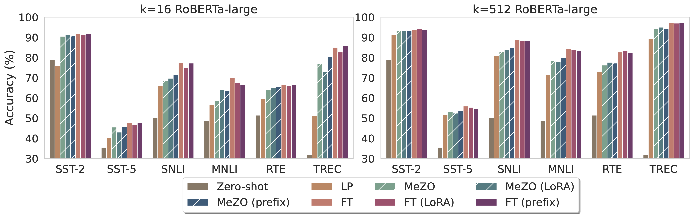
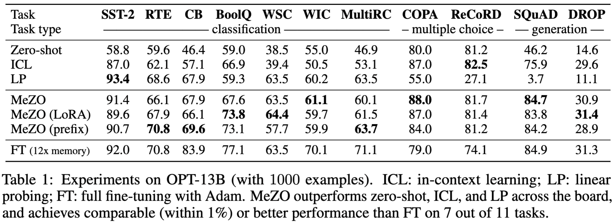
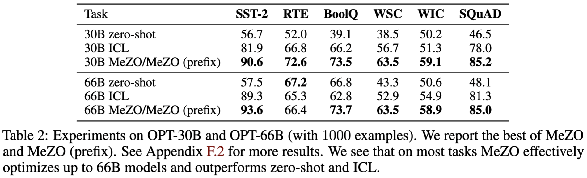
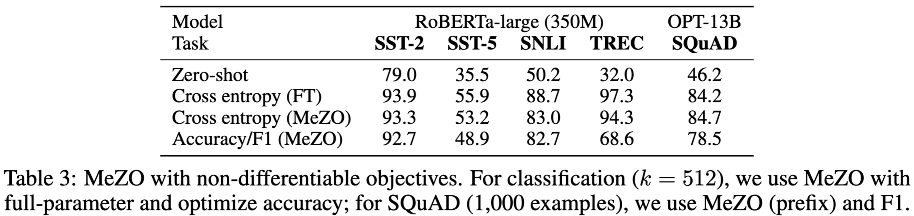

# Fine-Tuning Language Models with Just Forward Passes

> Sadhika Malladi., et al, "Fine-Tuning Language Models with Just Forward Passes," in *Thirty-seventh Conference on Neural Information Processing Systems*, 2023.

- Minjae Gwon
  - <minjae.gwon@postech.ac.kr>
  - <https://bxta.kr>
- ML Lab
  - <https://ml.postech.ac.kr>
- CompSec Lab
  - <https://compsec.postech.ac.kr>

---

```yaml
layout: leaflet
```

## Introduction

---

### Problem (1)

- Full Parameter Tuning
  - Computing gradients for backpropagation requires a prohibitive amount of memory.
  - Up to 12 times the memory required for inference.
- PEFT
  - Update just a fraction of the network parameters.
  - Up to 6 times more memory than inference.
- In-Context Learning (ICL)
  - Limited context size.
  - Performance is sensitive to the formatting and choice of demonstrations.

---

### Problem (2)

- Backpropagation
  - Cannot optimize non-differentiable criteria.
  - Expensive reinforcement learning from human feedback.
- ZO-SGD
  - In principle, the method can update neural networks with just forward passes.
  - Naive implementation still doubles the memory overhead.
  - Convergence slows linearly with model size.

---

### Contributions (1)

- Memory-efficient zeroth-order optimizer (MeZO)
  - Adapt the classical ZO-SGD algorithm.
  - Reduce memory consumption to the same as inference.
- Comprehensive experiments
  - Across model types, model scales, and downstream tasks.
  - Outperform zero-shot, ICL, and linear probing.
  - Requiring roughly 12 times less memory.
  - Requires only half as many GPU-hours as Adam fine-tuning for a 30B model.

---

### Contributions (2)

- Optimizing non-differentiable objectives
  - Accuracy or F1 score.
- Theoretical analysis
  - Convergence rate depends on the local effective rank.

---

```yaml
layout: leaflet
```

## Zeroth-Order Optimization

---

### Simultaneous Perturbation Stochastic Approximation (SPSA)

$$
\hat\nabla\mathcal{L}(\theta;\mathcal{B}) = \frac{\mathcal{L}(\theta + \epsilon z;\mathcal{B}) - \mathcal{L}(\theta - \epsilon z;\mathcal{B})}{2\epsilon}z \approx z z^\top \nabla\mathcal{L}(\theta;\mathcal{B})
$$

- Requires only two forward passes through the model.
  - For $n$-SPSA, each estimate requires $2n$ forward passes.
- Can be understood as a rank-1 reconstruction of the gradient.
  - As $\epsilon\to 0$.
- $n = 1$ is the most efficient.
  - Through cursory experiments.

---

### ZO-SGD

$$
\theta_{t+1} = \theta_t - \eta\hat\nabla\mathcal{L}(\theta;\mathcal{B}_t)
$$

- Costs twice the memory of inference.
  - Needs to store $z \in \mathbb{R}^d$.

---

### Memory-efficient ZO-SGD (MeZO) (1)

````md magic-move
```python{*|4,5|6,7|8|9,10,11}
for t in range(T):
    s = random_seed()
    for batch in dataset:
        theta = perturb(theta, epsilon, s)
        loss_p = loss(theta, batch)
        theta = perturb(theta, -2 * epsilon, s)
        loss_n = loss(theta, batch)
        theta = perturb(theta, epsilon, s)
        projected_grad = (loss_p - loss_n) / (2 * epsilon)
        random.seed(s)
        theta = theta - eta * projected_grad * random.normal(0, 1, theta.shape)
```
```python
def perturb(theta, epsilon, s):
    random.seed(s)
    return theta + epsilon * random.normal(0, 1, theta.shape)
```
````

---

### Memory-efficient ZO-SGD (MeZO) (2)

- Memory efficiency
  - Using in-place implementation.
    - Memory footprint equivalent to the inference memory cost.
- Storage efficiency
  - Reduces the storage cost of the resulting checkpoint.
    - Far more than popular PEFT techniques.
  - Reconstructs the MeZO trajectory using a single seed.
    - Spawns step-wise seeds to sample $z$.

---

### MeZO Extensions

- Using other ZO gradient estimators
  - Not as efficient as SPSA.
    - Revealed in cursory experiments.
- Can be Combined with other gradient-based optimizers
  - Including SGD with momentum or Adam.
- Note that all of the coordinates of the SPSA gradient estimate have the same scale.
  - Deep Transformers can have gradients of different scales for each layer.
  - Draw inspiration from layerwise adaptive optimizers.
    - Not more efficient.

---

```yaml
layout: leaflet
```

## Experiments

---

### Medium-sized Masked Language Models (1)



- Experiments on RoBERTa-large.
  - $k$ examples per class for $k=16$ and $k=512$.

---

### Medium-sized Masked Language Models (2)

- MeZO workds significantly better than zero-shot, linear probing, and other memory-equivalent methods.
  - Outperforms zero-shot and linear probing.
  - Outperforms BBTv2, another ZO algorithm, by up to $11\%$ absolute.
- With enough data, MeZO achieves comparable performance to FT.
  - Within 5\% gap for $k=512$.
- MeZO works well on both full-parameter tuning and PEFT.
  - Full-parameter tuning and PEFT achieve comparable performance.

---

### Large Autoregressive Language Models (1)



---

### Large Autoregressive Language Models (2)



---

### Large Autoregressive Language Models (3)

- MeZO outperforms memory-equivalent methods and closely approaches fine-tuning results.
  - Comparable or better performance on 7 out of the 11 tasks.
- MeZO exhibits strong performance across classification, multiple-choice, and generation tasks.
  - Outperforms zero-shot, ICL, and LP.

---

### Training with Non-differentiable Objectives



- MeZO with accuracy/F1 successfully optimizes LMs with superior performance to zero-shot.

---

### Memory Usage and Wall-clock Time Analysis (1)


- MeZO exhibits the same memory consumption as zero-shot.
  - Memory savings of up to 12 times compared to standard FT.

---

### Memory Usage and Wall-clock Time Analysis (2)

- Achives 7.74$\times$ per-step speedup and requires 8$\times$ fewer GPUs with a 30B model.
  - Requires only half as many GPU-hours as Adam fine-tuning for a 30B model.
    - However, MeZO takes more steps to converge.
- Wall-clock benefit of MeZO is not inherent to the algorithm.
  - Highly dependent on the implementation.

---

```yaml
layout: leaflet
```

## Theory

---

### Parameter Dimension Dependence (1)

- Lemma 1: Descent Lemma
  - Let $\mathcal{L}(\theta)$ be $\ell$-smooth.
  - For any unbiased gradient estimate $g(\theta, \mathcal{B})$,
    - $\mathbb{E}[\mathcal{L}(\theta_{t+1}) \mid \theta_t] - \mathcal{L}(\theta_t) \leq-\eta||\nabla \mathcal{L}(\theta_t)||^2 + \frac{1}{2}\eta^2\ell\cdot \mathbb{E}[||g(\theta, \mathcal{B})||^2]$.
  - Describes how much the loss function decreases after each step of optimization.
- Lemma 2: Gradient Norm of MeZO
  - $\mathbb{E}_x[||\hat \nabla \mathcal{L}(\theta; \mathcal{B})||^2] = \frac{d + n - 1}{n}\mathbb{E}[||\nabla\mathcal{L}(\theta;\mathcal{B})||^2]$.
  - Where $n$ is the number of $z$ sampled in $n$-SPSA and $d$ is the number of parameters.
  - In the usual case where $n\ll d$, MeZO has a much larger gradient norm than SGD.

---

### Parameter Dimension Dependence (2)

- Applying **Lemma 2** on the descent lemma results in $\eta_{\text{ZO}} = \frac{n}{d + n - 1}\eta_{\text{SGD}}$.
  - Represents the largest permissible learning rate for MeZO.
  - MeZO can slow optimization by decreasing the largest permissible learning rate by a factor of $d$.
- However...
  - Experiments show that MeZO can quickly optimize pre-trained models with billions of parameters.
    - Parameter dimension does not significantly affect the convergence rate?

---

### Local Effective Rank

- The optimization primarily occurs in a lower-dimensional subspace, known as the local r-effective rank $r$.
  - Despite the high dimensionality of the parameter space.
  - Only a small subset of parameters needed significant adjustment for pre-trained model during fine-tuning.
- The effective rank $r$ measures how many directions in the parameter space.
  - Contribute significantly to the optimization.

---

### Global Convergence Analysis

- The global convergence of MeZO depends on the effective local rank.
  - The number of iterations required for convergence grows with $r$.
    - Making MeZO efficient when $r$ is much smaller than $d$.

---

```yaml
layout: leaflet
```

## Conclusion

---

### Summary (1)

- Memory-efficient zeroth-order optimizer (MeZO)
  - Reduces memory consumption to the same as inference.
  - Outperforms zero-shot, ICL, and linear probing.
  - Optimizes non-differentiable objectives.
- Comprehensive experiments
  - Across model types, model scales, and downstream tasks.
  - Outperforms zero-shot, ICL, and linear probing.
  - Requiring roughly 12 times less memory.
  - Requires only half as many GPU-hours as Adam fine-tuning for a 30B model.

---

### Summary (2)

- Theoretical analysis
  - Convergence rate depends on the local effective rank.
- Future work
  - Combining MeZO with other memory-efficient methods.
  - Investigating the applicability of MeZO to other areas.

---

```yaml
layout: disclaimer
hideInToc: true
```

# Fine-Tuning Language Models with Just Forward Passes

> Sadhika Malladi., et al, "Fine-Tuning Language Models with Just Forward Passes," in *Thirty-seventh Conference on Neural Information Processing Systems*, 2023.

**Disclaimer** This document is intended solely for seminar series within the POSTECH TML. Any use of its contents outside of this context is not endorsed or supported by us. We explicitly disclaim any responsibility for the application or interpretation of the information contained herein beyond our organization's boundaries.

- 
- Minjae Gwon
  - <minjae.gwon@postech.ac.kr>
  - <https://bxta.kr>
- ML Lab / CompSec Lab
  - <https://ml.postech.ac.kr>
  - <https://compsec.postech.ac.kr>
