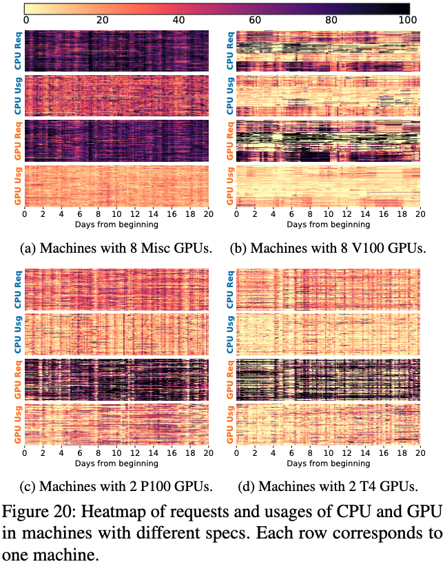

# MLaaS in the Wild: Workload Analysis and Scheduling in Large-Scale Heterogeneous GPU Clusters

> Qizhen Weng., et al, "MLaaS in the Wild: Workload Analysis and Scheduling in Large-Scale Heterogeneous GPU Clusters," in *19th USENIX Symposium on Networked Systems Design and Implementation (NSDI 22)*, 2022, pp. 945–960.

- Minjae Gwon
  - <minjae.gwon@postech.ac.kr>
  - <https://bxta.kr>
- ML Lab
  - <https://ml.postech.ac.kr>
- CompSec Lab
  - <https://compsec.postech.ac.kr>

---

```yaml
layout: leaflet
```

## Introduction

---

### Overview

- Shares experiences in running ML workloads in large GPU clusters.
  - Two-month workload trace.
  - A production cluster with 6742 GPUs in Alibaba PAI (Platform for AI).

---

```yaml
layout: leaflet
```

## Background

---

### Alibaba PAI

<div class="grid grid-cols-2 gap-4">

- All-in-one platform for training and inference.
  - Supports various ML frameworks.
  - Allocates containerized instances to heterogeneous nodes.
  - Users can specify the type of GPU and enable GPU sharing.


</div>

---

```yaml
layout: leaflet
```

## Workload Characterization

---

### Trace Overview

<div class="grid grid-cols-2 gap-4">

- Volume
  - Collected in July and August 2020 on 1800+ nodes, 6700+ GPUs.
  - 1.2M tasks with 7.5M instances, submitted by 1300+ users.
- Observations
  - 85% of instances are gang-scheduled.


</div>

---

### Temporal Pattern: Runtime

<div class="grid grid-cols-2 gap-4">

- Instance runtime in a wide range.
  - Similar to the Philly trace.
  - Ranges from seconds to hours.


</div>

---

### Temporal Pattern: Queueing Delays (1)

<div class="grid grid-cols-2 gap-4">

- Depends on the instance runtime.
  - Short-running instances have longer queueing delays.
  - 9% of short-running instances spend more than half of the completion time waiting to be scheduled.
  - This number drops to 3% for long-running instances.


</div>

---

### Temporal Pattern: Queueing Delays (2)

<div class="grid grid-cols-2 gap-4">

- Depends on the GPU sharing.
  - Instances willing to share GPUs can be quickly scheduled.
  - P90 queueing delay w/ GPU sharing: `497s`.
  - P90 queueing delay wo/ GPU sharing: `1150s`.


</div>

---

### Temporal Pattern: Queueing Delays (3)

<div class="grid grid-cols-2 gap-4">

- Depends on the GPU type.
  - High-end GPUs have longer queueing delays.
  - V100:
    - Median `113s`, P90 `13,709s`.
  - Low-end GPUs:
    - Median `11s`, P90 `360s`.


</div>

---

### Spatial Pattern: Resource Requests

<div class="grid grid-cols-2 gap-4">

- Heavy-tailed distribution of resource requests.
  - <span class="text-blue-500">Solid lines</span> in (a), (b), and \(c).
  - Around 20% instances request large resource amounts.
  - P95 request demands 12 vCPU cores, 1 GPU, and 59 GiB memory.
    - More than twice the median request.


</div>

---

### Spatial Pattern: Usage (1)

<div class="grid grid-cols-2 gap-4">

<div class="relative w-full" >

<div class="absolute z-10 bg-white pb-10">

- Uneven resource usage.
  - <span class="text-orange-500">Dotted lines</span> in (a), (b), and \(c).
  - Most users ask for more resources than they need.
    - Median usages are much smaller than the median request.

</div>


</div>


</div>

---

### Spatial Pattern: Usage (2)

<div class="grid grid-cols-2 gap-4">

- Low on GPU but high on CPU.
  - Figure (d).
  - Low GPU usage due to contentions on other resources.
  - 19% task instances overuse CPUs.
    - <span class="text-blue-500">Blue solid line</span> with $X > 0$.
    - While only 3% instances use more GPUs than they requested.


</div>

---

```yaml
layout: leaflet
```

## GPU Machine Utilization

---

### Utilization of Compute Resources (1)

<div class="grid grid-cols-2 gap-4">

- 8-GPU machines
  - <span class="text-red-500">GPU</span> utilization: `High`
  - <span class="text-blue-500">CPU</span> utilization: `High`
- 2-GPU machines
  - <span class="text-red-500">GPU</span> utilization: `High`
  - <span class="text-blue-500">CPU</span> utilization: `Medium`
    - Due to the large CPU-to-GPU ratio.

<div class="relative">

<div v-click.hide class="bg-black opacity-10 z-10 absolute w-1/2 h-full left-0"></div>
<div v-after class="bg-black opacity-10 z-10 absolute w-1/2 h-full right-0"></div>


</div>

</div>

---

### Utilization of Compute Resources (2)

<div class="grid grid-cols-2 gap-4">

- A larger variation of utilization on GPUs.
  - P90 GPU utilization spans a wide range.
    - Due to bursty GPU usage patterns in ML workloads?

<div class="relative">

<div class="bg-black opacity-10 z-10 absolute w-full h-1/2 left-0"></div>


</div>

</div>

---

```yaml
layout: leaflet
```

## Opportunities for Cluster Management

---

### GPU Sharing (1)

- PAI cluster scheduler supports GPU sharing.
  - Space-multiplexed:
    - A task instance can request a fraction of GPU.
    - Guaranteed to allocate the specified fraction of GPU memory.
  - Time-multiplexed:
    - An instance can use unallocated GPU memory during execution.
    - No guaranteed allocation of compute units.
      - Dynamically shared among co-located instances.

---

### GPU Sharing (2)

<div class="h-[200px]">

- GPU sharing saves 50% of GPUs on average.
  - 2500 GPUs in the peak hour.

</div>


---

### GPU Sharing (3)

<div class="h-[200px]">

- Does not cause severe GPU contention.
  - On $\geq$ 95% utilized GPUs, only ~4% of them have <span class="text-orange-500">$\geq$ 2 workers </span> run simultaneously.

</div>


---

### Predictable Duration for Recurring Tasks (1)

<div class="h-[210px]">

- Recurring tasks are prevalent.
  - 65% tasks run at least 5 times in the trace.
  - Criteria of repetition: Group tag -- hash of jobs' customized input.

</div>


---

### Predictable Duration for Recurring Tasks (2)

<div class="h-[300px]">

- Recurring tasks are predictable in duration.
  - Using Classification and Regression Trees (CART) algorithm.
  - Results in less than 25% prediction error for 78% instances.

</div>


---

### Predictable Duration for Recurring Tasks (3)

<div class="h-[300px]">

- Predicted duration benefits for scheduling.
  - SJF schedulers reduce the average task completion time by 63–77%.

</div>


---

```yaml
layout: leaflet
```

## Challenges of Scheduling

---

### Deployed Scheduling Policy (1)

- Reserving-and-packing
  - Prioritizes reserving high-end GPUs for high-GPU tasks.
    - The scheduler characterizes computation efficiency using a performance model.
      - Degree of parallelism, ML model, size of embedding, and historical profiles.
  - Packs other workloads to machines with less advanced GPUs.
- Load-balancing
  - Maintains load balancing across machines with similar specs.
  - Prioritizes instance scheduling to machines with low allocation rate.

---

### Deployed Scheduling Policy (2)

<div class="h-[250px]">

- Prioritizes reserving-and-packing over load-balancing.
  - Reduces the average task queueing by 45%.
  - Reduces the average task queueing delay by 68% for instances requesting V100 GPUs.

</div>


---

### Open Challenge: CPU can be the Bottleneck

<div class="h-[200px]">

- Task delays are more likely due to be observed under high CPU utilization.
  - Rather than high GPU utilization.

</div>

<div class="relative w-full h-[500px] mx-auto">


</div>

---

### Open Challenge: Majority of High-CPU-Low-GPU Tasks

<div class="grid grid-cols-3 gap-10">

<div>


- CTR tasks could spend ~80% time on CPU.
  - e.g. Fetch and preprocess.

</div>

<div>


- GNNs spend <br>30-90% time on:
  - Edge iteration, ...

</div>

<div>


- RL launches massive <br>CPU-intensive tasks.
  - e.g. Simulations.

</div>

</div>

---

### Open Challenge: Imbalanced Scheduling

<div class="grid grid-cols-2 gap-4">

- (a) / Overcrowded weak-GPU machines
  - 77% CPUs and 74% GPUs are allocated.
- (b) / Imbalanced load in high-end machines.
  - 35% CPUs and 49% GPUs are allocated.
  - Reserved for a small number of important high-GPU tasks.
- \(c), (d) / Underutilized CPUs despite GPUs being heavily occupied.
  - 31% CPUs allocated with only 19% CPU utilization.



</div>

---

```yaml
layout: leaflet
```

## Conclusion

---

### Summary

- Characterized a two-month production trace in Alibaba PAI.
  - Most tasks are gang-scheduled and recurrent.
  - Short-running instances have longer queueing delays.
- Explored opportunities for cluster management.
  - GPU sharing saves 50% of GPUs.
  - Predictable duration benefits scheduling.
- Deployed scheduling policy; Reserving-and-packing.
- Remaining challenges; CPU bottleneck and load imbalance.

---

```yaml
layout: disclaimer
hideInToc: true
```

# MLaaS in the Wild: Workload Analysis and Scheduling in Large-Scale Heterogeneous GPU Clusters

> Qizhen Weng., et al, "MLaaS in the Wild: Workload Analysis and Scheduling in Large-Scale Heterogeneous GPU Clusters," in *19th USENIX Symposium on Networked Systems Design and Implementation (NSDI 22)*, 2022, pp. 945–960.

**Disclaimer:** This document is intended solely for the CSED703O lecture at POSTECH. Any use of its contents outside of this context is not endorsed or supported by us. We explicitly disclaim any responsibility for the application or interpretation of the information contained herein beyond our organization's boundaries.

- 
- Minjae Gwon
  - <minjae.gwon@postech.ac.kr>
  - <https://bxta.kr>
- ML Lab / CompSec Lab
  - <https://ml.postech.ac.kr>
  - <https://compsec.postech.ac.kr>
