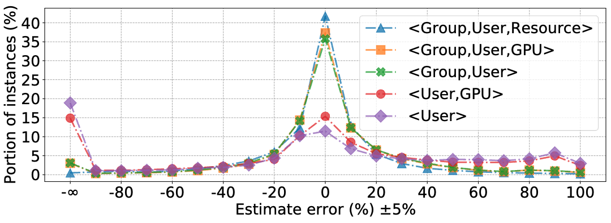

# MLaaS in the Wild: Workload Analysis and Scheduling in Large-Scale Heterogeneous GPU Clusters

> Qizhen Weng., et al, "MLaaS in the Wild: Workload Analysis and Scheduling in Large-Scale Heterogeneous GPU Clusters," in *19th USENIX Symposium on Networked Systems Design and Implementation (NSDI 22)*, 2022, pp. 945–960.

- Minjae Gwon
  - <minjae.gwon@postech.ac.kr>
  - <https://bxta.kr>
- ML Lab
  - <https://ml.postech.ac.kr>
- CompSec Lab
  - <https://compsec.postech.ac.kr>

---

```yaml
layout: leaflet
```

## Introduction

---

### Overview

- Shares experiences in running ML workloads in large GPU clusters.
  - Analyzes a two-month workload trace.
  - Describes a production cluster with 6742 GPUs in Alibaba PAI (Platform for AI).

---

```yaml
layout: leaflet
```

## Background

---

### Alibaba PAI

<div class="grid grid-cols-2 gap-4">

- Comprehensive platform for both training and inference.
  - Supports multiple ML frameworks.
  - Allocates containerized instances to diverse nodes.
  - Allows users to specify GPU types and enable GPU sharing.


</div>

---

```yaml
layout: leaflet
```

## Workload Characterization

---

### Trace Overview

<div class="grid grid-cols-2 gap-4">

- Volume
  - Collected in July and August 2020 on over 1800 nodes and more than 6700 GPUs.
  - Includes 1.2 million tasks with 7.5 million instances, submitted by over 1300 users.
- Observations
  - 85% of instances are gang-scheduled.


</div>

---

### Temporal Pattern: Runtime

<div class="grid grid-cols-2 gap-4">

- Instance runtimes vary widely.
  - Similar to the Philly trace.
  - They range from seconds to hours.


</div>

---

### Temporal Pattern: Queueing Delays (1)

<div class="grid grid-cols-2 gap-4">

- Queueing delays depend on instance runtime.
  - Short-running instances experience longer queueing delays.
  - 9% of short-running instances spend more than half of their completion time waiting to be scheduled.
  - This number drops to 3% for long-running instances.


</div>

---

### Temporal Pattern: Queueing Delays (2)

<div class="grid grid-cols-2 gap-4">

- Queueing delays depend on GPU sharing.
  - Instances willing to share GPUs can be scheduled more quickly.
  - P90 queueing delay with GPU sharing: `497s`.
  - P90 queueing delay without GPU sharing: `1150s`.


</div>

---

### Temporal Pattern: Queueing Delays (3)

<div class="grid grid-cols-2 gap-4">

- Queueing delays vary by GPU type.
  - High-end GPUs experience longer queueing delays.
  - V100:
    - Median: `113s`, P90: `13,709s`.
  - Low-end GPUs:
    - Median: `11s`, P90: `360s`.


</div>

---

### Spatial Pattern: Resource Requests

<div class="grid grid-cols-2 gap-4">

- Heavy-tailed distribution of resource requests.
  - <span class="text-blue-500">Solid lines</span> in (a), (b), and \(c\).
  - Approximately 20% of instances request large amounts of resources.
  - The P95 request demands 12 vCPU cores, 1 GPU, and 59 GiB of memory.
    - This is more than twice the median request.


</div>

---

### Spatial Pattern: Usage (1)

<div class="grid grid-cols-2 gap-4">

<div class="relative w-full" >

<div class="absolute z-10 bg-white pb-10">

- Uneven resource usage.
  - <span class="text-orange-500">Dotted lines</span> in (a), (b), and \(c\).
  - Most users request more resources than they actually use.
    - Median usage is significantly lower than the median request.

</div>


</div>


</div>

---

### Spatial Pattern: Usage (2)

<div class="grid grid-cols-2 gap-4">

- Low GPU usage but high CPU usage.
  - Figure (d).
  - Low GPU usage is due to contention on other resources.
  - 19% of task instances overuse CPUs.
    - <span class="text-blue-500">Blue solid line</span> with $X > 0$.
    - Only 3% of instances use more GPUs than they requested.


</div>

---

```yaml
layout: leaflet
```

## GPU Machine Utilization

---

### Utilization of Compute Resources (1)

<div class="grid grid-cols-2 gap-4">

- 8-GPU machines
  - <span class="text-red-500">GPU</span> utilization: `High`
  - <span class="text-blue-500">CPU</span> utilization: `High`
- 2-GPU machines
  - <span class="text-red-500">GPU</span> utilization: `High`
  - <span class="text-blue-500">CPU</span> utilization: `Medium`
    - Due to the large CPU-to-GPU ratio.

<div class="relative">

<div v-click.hide class="bg-black opacity-10 z-10 absolute w-1/2 h-full left-0"></div>
<div v-after class="bg-black opacity-10 z-10 absolute w-1/2 h-full right-0"></div>


</div>

</div>

---

### Utilization of Compute Resources (2)

<div class="grid grid-cols-2 gap-4">

- Significant variation in GPU utilization.
  - P90 GPU utilization shows a wide range.
    - This is likely due to the bursty nature of GPU usage patterns in ML workloads.

<div class="relative">

<div class="bg-black opacity-10 z-10 absolute w-full h-1/2 left-0"></div>


</div>

</div>

---

```yaml
layout: leaflet
```

## Opportunities for Cluster Management

---

### Goal

- Maximizing GPU machine utilization.
- Ensuring rapid task completion.

---

### GPU Sharing (1)

- The PAI cluster scheduler supports GPU sharing.
  - Space-multiplexed:
    - A task instance can request a fraction of a GPU.
    - It is guaranteed to allocate the specified fraction of GPU memory.
  - Time-multiplexed:
    - An instance can use unallocated GPU memory during execution.
    - There is no guaranteed allocation of compute units.
      - Compute units are dynamically shared among co-located instances.

---

### GPU Sharing (2)

<div class="h-[200px]">

- GPU sharing saves 50% of GPUs on average.
  - This equates to 2500 GPUs during peak hours.

</div>


---

### GPU Sharing (3)

<div class="h-[200px]">

- Does not cause severe GPU contention.
  - On GPUs with $\geq$ 95% utilization, only about 4% have $\geq$ 2 workers running simultaneously.

</div>


---

### Predictable Duration for Recurring Tasks (1)

<div class="h-[210px]">

- Recurring tasks are prevalent.
  - 65% tasks run at least 5 times in the trace.
  - Criteria of repetition: Group tag -- hash of jobs' customized input.

</div>


---

### Predictable Duration for Recurring Tasks (2)

<div class="h-[300px]">

- Recurring tasks have predictable durations.
  - Using the Classification and Regression Trees (CART) algorithm.
  - Results in less than 25% prediction error for 78% of instances.

</div>



---

### Predictable Duration for Recurring Tasks (3)

<div class="h-[300px]">

- Benefits of Predictable Duration for Scheduling
  - Shortest Job First (SJF) schedulers reduce the average task completion time by 63–77%.

</div>


---

```yaml
layout: leaflet
```

## Challenges of Scheduling

---

### However

- The real world is complicated!
  - Scheduling ML tasks with large heterogeneity in production clusters is far more complex.

---

### Reserving-and-Packing: Background

<div class="grid grid-cols-2 gap-4">

- High-GPU tasks are first-class citizens.
  - They request powerful GPU devices with high memory bandwidth or advanced hardware features (e.g., NVLink).
  - They have picky scheduling requirements.
  - They are run by business-critical applications.


</div>

---

### Reserving-and-Packing: Design

- Reserving
  - Intentionally reserves high-end GPUs for high-GPU tasks.
- Packing
  - Packs other workloads onto machines with less advanced GPUs.

---

### Reserving-and-Packing: Implementation

- How to determine high-GPU tasks?
  - The scheduler characterizes *computation efficiency* using a performance model.
  - Factors include the degree of parallelism, ML model, size of embedding, and historical profiles.
  - High-GPU Task: `Computation Efficiency >= Certain Threshold`
- How to reserve high-end GPUs?
  - The scheduler generates an ordered sequence of allocation plans.
  - It attempts allocation following the ordered plans.
  - High-GPU tasks are attempted first.

---

### Load-Balancing: Background

<div class="grid grid-cols-2 gap-4">

- Co-located instances can interfere with each other.
  - Especially on machines with high CPU utilization.
- Training speed can slow down by up to 28%.
  - Due to contention for shared resources.
    - Cache, power, memory bandwidth.


</div>

---

### Load-Balancing: Design

- Prioritizes scheduling instances to machines with low allocation rates.
  - Measured as a weighted sum of the allocated CPUs, memory, and GPUs, normalized by the machine’s capacity.

---

### Deployed Scheduling Policies

<div class="h-[250px]">

- Prioritizes reserving-and-packing over load-balancing.
  - Reduces the average task queueing time by 45%.
  - Reduces the average task queueing delay by 68% for instances requesting V100 GPUs.

</div>


---

### Open Challenges

- Remaining challenges in scheduling ML workloads.
  - Especially in heterogeneous GPU clusters.

---

### Open Challenges: Mismatch Between Specs and Requests (1)

<div class="h-[500px]">

- Mismatch between machine specifications and instance requests.
  - 8-GPU machines: 12 vCPU cores per GPU.
    - Instances request 22.8 vCPU cores per GPU.
  - 2-GPU machines: Over-provisioned CPUs.
    - CPU-to-GPU ratio is more than twice that of the instance requests.
    - CPUs are heavily underutilized despite GPUs being heavily occupied.

</div>


---

### Open Challenges: Mismatch Between Specs and Requests (2)

<div class="flex w-full justify-center gap-4">
  
  
</div>

---

### Open Challenges: Overcrowded Weak-GPU Machines

<div class="flex gap-4">

<div class="grow">

- Less advanced GPUs are overcrowded.
  - 77% of CPUs and 74% of GPUs are allocated in 8-GPU nodes.
  - This is caused by the scheduling algorithm prioritizing weak-GPU machines for low-GPU tasks.

</div>


</div>

---

### Open Challenges: Imbalanced Load in High-End Machines

<div class="flex gap-4">

<div class="grow">

- High-end machines with advanced V100 GPUs are less crowded.
  - Average allocation ratios of CPUs and GPUs are 35% and 49%, respectively.
  - Reserved for a small number of important high-GPU tasks.
- Imbalanced load among V100 machines.
  - Machines near the bottom are more crowded than others.
    - The current load-balancing algorithm has room for improvement.

</div>

<div class="relative">
<div v-click class="absolute w-full h-full">
<span class="absolute w-full h-[40px] bg-red opacity-50 top-[33%]"></span>
<span class="absolute w-full h-[40px] bg-red opacity-50 top-[73%]"></span>
</div>

</div>
</div>

---

### Open Challenges: CPU can be the Bottleneck (1)

<div class="grid grid-cols-3 gap-10">

<div>


- CTR tasks could spend ~80% time on CPU.
  - e.g. Fetch and preprocess.

</div>

<div>


- GNNs spend <br>30-90% time on:
  - Edge iteration, ...

</div>

<div>


- RL launches massive <br>CPU-intensive tasks.
  - e.g. Simulations.

</div>

</div>

---

### Open Challenges: CPU can be the Bottleneck (2)

<div class="h-[400px]">

- Machines running delayed instances measure higher <span class="text-blue">CPU</span> utilization.
  - Such a correlation is not found on <span class="text-red">GPUs</span>.

</div>


---

### Open Challenges: CPU can be the Bottleneck (3)

<div class="h-[250px]">

- Machines with over 24% CPU utilization run 50% of delayed instances.
  - This is evidence of a strong correlation between CPU contention and instance slowdown.
  - GPU contention does not clearly contribute to instance slowdown.

</div>


---

```yaml
layout: leaflet
```

## Discussion

---

### Support of Elastic Scheduling

- Elastic scheduling allows a training job to dynamically adjust the number of workers on the fly.
  - Pros: Easier to handle than gang-scheduled jobs.
  - Cons: Introduces non-determinism to the final model accuracy.

---

### Machine Provisioning and Resource Disaggregation

- GPU schedulers should account for machine provisioning.
  - 8-GPU machines provide abundant GPU processing power.
  - 2-GPU machines can be a better fit for tasks with heavy CPU processing.
- Many system works propose to:
  - Decompose monolithic machines into a number of distributed, disaggregated hardware components.
    - For improved hardware elasticity.
  - Despite the non-negligible communication overhead.

---

```yaml
layout: leaflet
```

## Conclusion

---

### Summary

- Characterized a two-month production trace in Alibaba PAI.
  - Most tasks are gang-scheduled and recurrent.
  - Short-running instances experience longer queueing delays.
- Explored opportunities for cluster management.
  - GPU sharing and predictable duration for recurring tasks.
- Deployed scheduling policies.
  - Prioritized reserving-and-packing over load-balancing.
- Remaining challenges:
  - CPU bottleneck and load imbalance.

---

```yaml
layout: disclaimer
hideInToc: true
```

# MLaaS in the Wild: Workload Analysis and Scheduling in Large-Scale Heterogeneous GPU Clusters

> Qizhen Weng., et al, "MLaaS in the Wild: Workload Analysis and Scheduling in Large-Scale Heterogeneous GPU Clusters," in *19th USENIX Symposium on Networked Systems Design and Implementation (NSDI 22)*, 2022, pp. 945–960.

**Disclaimer:** This document is intended solely for the CSED703O lecture at POSTECH. Any use of its contents outside of this context is not endorsed or supported by us. We explicitly disclaim any responsibility for the application or interpretation of the information contained herein beyond our organization's boundaries.

- 
- Minjae Gwon
  - <minjae.gwon@postech.ac.kr>
  - <https://bxta.kr>
- ML Lab / CompSec Lab
  - <https://ml.postech.ac.kr>
  - <https://compsec.postech.ac.kr>

<!--
- 영어 문법 폴리시
- 하이엔드/로우엔드 디자인 챌린지 뒷부분 강조
- 앞 부분 패턴은 중요하지 않다. (패턴~ 큐잉 딜레이~ 필리랑 비교했을 때~ 중요하지 않음)
- 알리바바 클러스터가 어떻게 구성이 되어 있고~ 이런 패턴 때문에 이렇게 스케쥴링 하는 것이 중요하다~
- CPU 바틀넥이 큐잉 딜레이를 저해하는 것도 있다~ 이런 것을 천천히 설명하는 것이 좋을 것 같다.
- 디자인 챌린지,인사이트,구현에 힘을 줘서 설명
- 분석 논문
  - 분석을 한 후에 인사이트 부분이 가장 중요하다
  - 워크로드가 예전하고 지금하고 알리바바 논문이랑 필리랑 좀 다르다...
  - 워크로드가 아니면 시스템이 차이가 있어서 차이에서 예전에 분석했던 것을 revisiting
  - 큐잉 딜레이, 유틸 등을 리비짓한것도 중요한 인포메이션
  - 새로운 시스템 기능 때문에 나오는 것으로 인한 분석 방향의 차이... GPU 쉐어링을 적극적으로 활용 -> 얼마나 베네핏이 있었는지
  - **그래서 앞으로 어떤 시스템 피쳐가 필요하냐 어떤 문제에 조금 더 집중해야하는냐~**
  - 분석은 결국 인사이트를 주기 위한 것
-->
