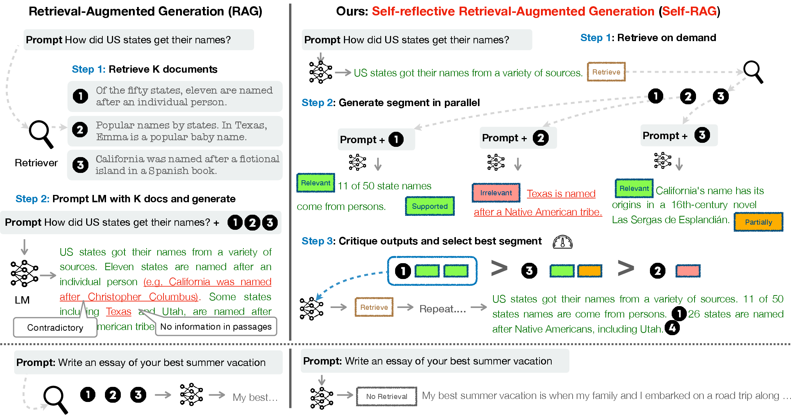
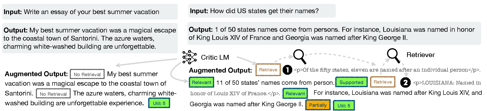
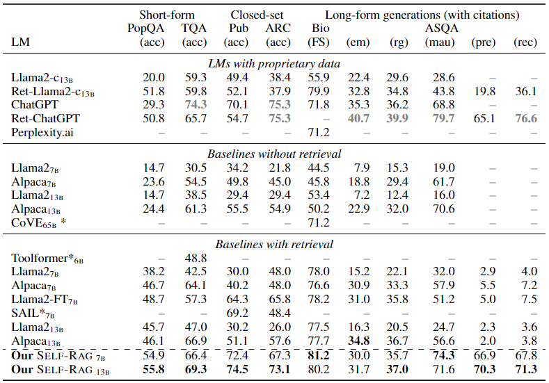
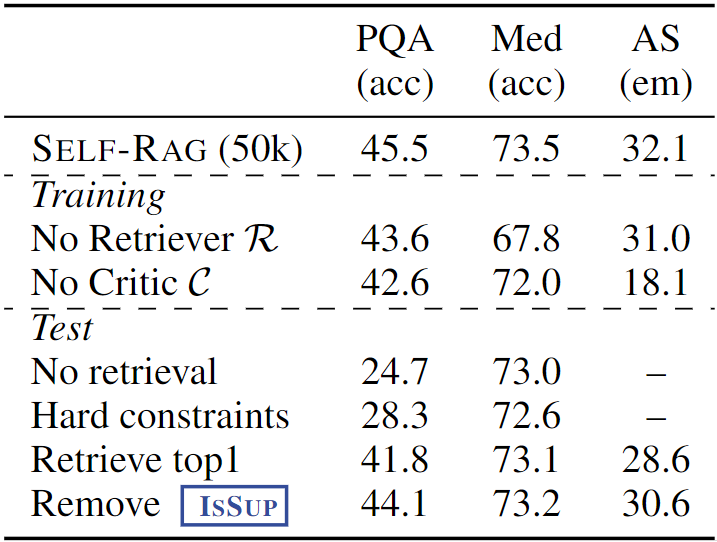
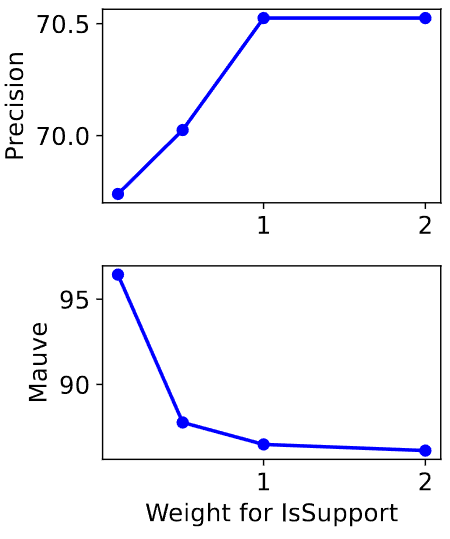
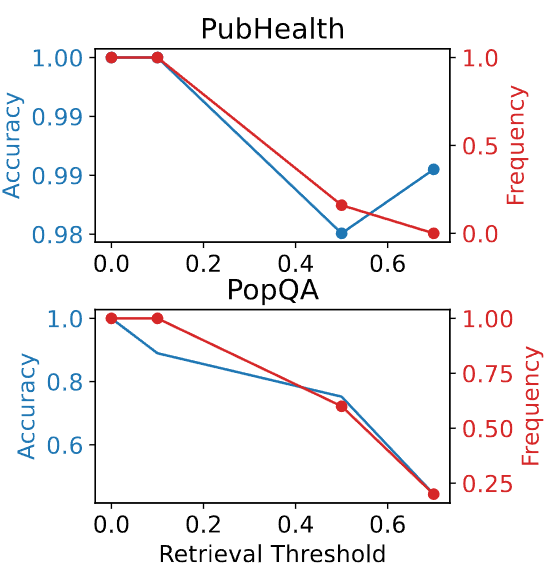

# Self-RAG: Learning to Retrieve, Generate, and Critique through Self-Reflection

> Akari Asai, et al, "Self-RAG: Learning to Retrieve, Generate, and Critique through Self-Reflection," in *The Twelfth International Conference on Learning Representations*, 2024.

- Minjae Gwon
  - <minjae.gwon@postech.ac.kr>
  - <https://bxta.kr>
- ML Lab
  - <https://ml.postech.ac.kr>
- CompSec Lab
  - <https://compsec.postech.ac.kr>

---

```yaml
layout: leaflet
```

## Introduction

---

### Problems

- Retrieval-Augmented Generation (RAG)
  - **Causes**
    - Retrieve passages indiscriminately regardless of necessity.
    - Models are not explicitly trained to leverage and follow facts from provided passages.
  - **Effects**
    - Hinder versatility of LLMs.
    - Introduce unnecessary or off-topic passages.
    - Output is not guaranteed to be consistent with retrieved relevant passages.

---

### Contributions: Self-RAG (1)

- Objective
  - Improve generation quality, including factual accuracy without hurting versatility.
- Approach
  - On-demand retrieval and self-reflection.
- Key Features
  - Reflection tokens for retrieval and critique.
  - Customizable decoding algorithm
- Differences from RAG
  - Retrieve passages on demand and criticize its own output.
  - Provide citations for each segment.

---

### Contributions: Self-RAG (2)



---

### Contributions: Self-RAG (3)

- Components
  - Generator LM
    - Trained on a diverse collection of text interleaved with reflection tokens and retrieved passages.
  - Reflection tokens
    - Inspired by reward models used in reinforcement learning.
    - Inserted offline into the original corpus by a trained critic model.
  - Critic model
    - Supervised on a dataset of input, output, and corresponding reflection tokens.
      - Collected by prompting a propriety LM (i.e., *GPT-4*).

---

### Contributions: Self-RAG (4)

- Possibility: Customizable Decoding Algorithm
  - Satisfy hard or soft constraints defined by reflection token predictions.
  - Flexibly adjust retrieval frequency for different downstream applications.
  - Customize models' behaviors to user preferences by leveraging reflection tokens through segment-level beam search.

- Empirical Results
  - Outperforms pre-trained and instruction-tuned LLMs.
  - Outperforms widely adopted RAG approaches with higher citation accuracy.
  - Outperforms retrieval-augmented ChatGPT on four tasks, Llama2-chat and Alpaca on all tasks.

---

```yaml
layout: leaflet
```

## Self-RAG: Learning to Retrieve, Generate, and Critique

---

### Problem Formalization (1)

- Given input $x$, train $\mathcal{M}$ to sequentially generate textual outputs $y$ consisting of multiple segments $y=[y_1, \dots, y_T]$.
  - Where $y_t$ indicates a sequence of tokens for the $t$-th segment.
  - Generated tokens in $y_t$ include text from the original vocabulary as well as the reflection tokens.

---

### Problem Formalization (2)

| Type  | Input  | Output  | Definitions  |
|:---:|:---:|:---:|---|
| `Retrieve`  | $x$ / $x,y$  | {yes, no, continue}  | Decides when to retrieve with $\mathcal{M}$  |
| `Is Relative`  | $x, d$  | {relevant, irrelevant}  | $d$ provides useful information to solve $x$  |
| `Is Supported`  | $x, d, y$  | {fully supported, partially supported, no support}  | All of the verification-worthy statement in $y$ is supported by $d$  |
| `Is Useful`  | $x, y$  | {5, 4, 3, 2, 1}  | $y$ is a useful response to $x$  |

---

### Inference Overview (1)

- Algorithm
  - $\mathcal{M}$ predicts `Retrieve` given $(x,y_{<t})$
  - If `Retrieve` == `Yes`
    - Retrieve relevant text passages $\mathbf{D}$ using $\mathcal{R}$ given $(x,y_{t-1})$
    - $\mathcal{M}$ predicts `Is Relative` given $x, d$ and `Is Supported` given $x,d,y_{<t}$ for each $d \in \mathbf{D}$
    - $\mathcal{M}$ predicts `Is Useful` given $x, y_t, d$ for each $d \in \mathbf{D}$
    - Rank $y_t$ based on `Is Relative`, `Is Supported`, `Is Useful`
  - If `Retrieve` == `No`
    - $\mathcal{M}$ predicts $y_t$ given $x$
    - $\mathcal{M}$ predicts `Is Useful` given $x,y_t$

---

### Inference Overview (2)

1. Model decodes a retrieval token to evaluate the utility of retrieval.
2. If retrieval is not required, the model predicts the next output segment.
3. If retrieval is needed, the model generates:
   - A critique token to evaluate the retrieved passage's relevance.
   - The next response segment.
   - A critique token to evaluate if the information in the response segment is supported by the passage.
   - A new critique token evaluates the overall utility of the response.

---

### Inference Overview (3)


---

### Training Overview

- Algorithm
  - Initialize critic $\mathcal{C}$ with a pre-trained LM
  - for $(x, y) \in \{X^{sample}, Y^{sample}\} \sim \{X, Y\}$
    - Prompt GPT-4 to collect a reflection token $r$ for $(x,y)$
    - Add $\{(x, y, r)\}$ to $\mathcal{D}_{critic}$
  - Update $\mathcal{C}$ on $\mathcal{D}_{critic}$ with next token prediction loss
  - Initialize generator $\mathcal{M}$ with a pre-trained LM
  - for $(x, y) \in (X, Y)$
    - Run $\mathcal{C}$ to predict $r$ given $(x, y)$
    - Add $(x, y, r)$ to $\mathcal{D}_{gen}$
  - Update $\mathcal{M}$ on $\mathcal{D}_{gen}$ with next token prediction loss

---

### Training the Critic Model: Data Collection

- Create supervised data by prompting GPT-4 to:
  - Generate reflection tokens.
  - Distill their knowledge into an in-house critic.
- Example: `Retrieve` token
  - Prompt: "Given an instruction, make a judgment on whether finding some external documents from the web helps to generate a better response."
    - Few-shot demonstrations $I$, original task input $x$ and output ${y}$ to predict an appropriate reflection token as text: $p(r|I, x, y)$.
  - Manual assessment reveals high agreement with human evaluations.
  - Collect 4k-20k supervised training data for each type.

---

### Training the Critic Model: Learning

$$
\max_{\mathcal{C}}\mathbb{E}[(x,y,r) \sim \mathcal{D}_{critic}] \log p_{\mathcal{C}} (r| x, y)
$$

- Initialize critic $\mathcal{C}$ with a pre-trained LM.
  - Train $\mathcal{C}$ on $\mathcal{D}_{critic}$ with next token prediction loss.
  - Used the same pre-trained LM as the generator LM (i.e., Llama 2-7B).
  - Achieves a higher than 90\% agreement with GPT-4-based predictions on most reflection token categories.

---

### Training the Generator Model: Data Collection (1)

- Augment the original output $y$ using the retrieval and critic models.



---

### Training the Generator Model: Data Collection (2)

````md magic-move
```xml
1 of 50 states names come from persons.
For instance, Louisiana was named in honor of King Louis XIV of France and Georgia ...
```
```xml
<RETRIEVE> 
1 of 50 states names come from persons.
<RETRIEVE>
For instance, Louisiana was named in honor of King Louis XIV of France and Georgia ...
```
```xml
<RETRIEVE> 
Of the fifty states, eleven are named after individual person.
1 of 50 states names come from persons.
<RETRIEVE>
LOUISIANA: Named in honor of Louis XIV of France.
For instance, Louisiana was named in honor of King Louis XIV of France and Georgia ...
```
```xml
<RETRIEVE> 
Of the fifty states, eleven are named after individual person.
<RELEVANT>
1 of 50 states names come from persons.
<RETRIEVE>
LOUISIANA: Named in honor of Louis XIV of France.
<RELEVANT>
For instance, Louisiana was named in honor of King Louis XIV of France and Georgia ...
```
```xml
<RETRIEVE> 
Of the fifty states, eleven are named after individual person.
<RELEVANT>
1 of 50 states names come from persons.
<SUPPORTED>
<RETRIEVE>
LOUISIANA: Named in honor of Louis XIV of France.
<PARTIALLY-SUPPORTED>
<RELEVANT>
For instance, Louisiana was named in honor of King Louis XIV of France and Georgia ...
```
````

---

### Training the Generator Model: Learning

$$
\max_{\mathcal{M}}\mathbb{E}[(x,y,r) \sim \mathcal{D}_{gen}] \log p_{\mathcal{M}} (y, r| x)
$$

- Train the generator model $\mathcal{M}$ on the augmented corpus $\mathcal{D}_{gen}$.
  - Mask out the retrieved text chunks for loss calculation.
  - Expand the original vocabulary with reflection tokens.

---

### Training the Generator Model: Connection to Prior Work

- Recent work
  - Incorporates additional critique during training, e.g., RLHF via PPO.
  - Relies on separate reward models during training.
- Our work
  - Computes critique offline and directly inserts them into the training corpus.
  - Significantly reduces training costs compared to PPO.
  - Relates to prior work that incorporates special tokens to control generation.

---

### Self-RAG Inference: Adaptive Retrieval with Threshold

- Allows a threshold to be set.
  - If the probability of generating the `Retrieve=Yes` token surpasses a designated threshold, we trigger retrieval.

---

### Self-RAG Inference: Tree-Decoding with Critique Tokens (1)

- At each segment step $t$, when retrieval is required:
  - Retrieve $K$ passages.
  - Process each passage in parallel and output $K$ different continuation candidates.
  - Conduct a segment-level beam search to obtain the top-$B$ segment continuations at each timestamp $t$.
  - Return the best sequence at the end of generation.

---

### Self-RAG Inference: Tree-Decoding with Critique Tokens (2)

$$
\begin{aligned}
    f(y_t,  d, \text{critique}) &= p(y_{t} | x, d, y_{<t}) + \mathcal{S}(\text{critique}) \\
    \mathcal{S}(\text{critique}) &= \sum_{G \in \mathcal{G}} w^G s_t^G \quad \text{for } \mathcal{G} = \{\text{Is Relative}, \text{Is Supported}, \text{Is Useful}\}
\end{aligned}
$$

- $s_t^G = \frac{p_t(\hat{r})}{\sum_{i=1}^{N^G} p_t(r_i)}$
  - Generation probability of the most desirable reflection token $\hat{r}$ for the critique token type $G$ with $N^G$ distinct tokens.
- Weights $w^G$
  - Hyperparameters that can be adjusted at inference time.

---

```yaml
layout: leaflet
```

## Experiments

---

### Tasks (1)

- Closed-set tasks
  - Datasets
    - Fact verification dataset about public health (PubHealth).
    - Multiple-choice reasoning dataset created from scientific exams (ARC-Challenge).
  - Metrics
    - Accuracy. Aggregate answer probabilities of target classes.

---

### Tasks (2)

- Short-form generations tasks
  - Datasets
    - Open-domain question answering datasets (PopQA, TriviaQA-unfiltered).
  - Metrics
    - Whether gold answers are included in the model generations.

---

### Tasks (3)

- Long-form generation tasks
  - Datasets
    - Biography generation task.
    - Long-form QA task (ALCE-ASQA).
  - Metrics
    - Correctness (str-em), fluency (MAUVE), citation precision and recall.

---

### Baselines

- Baselines without retrievals
  - Llama2 (7B, 13B), Alpaca (7B, 13B), ChatGPT, Llama2-chat (13B).
- Baselines with retrievals
  - Llama2-FT, Ret-ChatGPT, Ret-Llama2-chat, SAIL, Toolformer.

---

### Experimental Settings

- Training data and settings
  - 150k instruction-output pairs from Open-Instruct and knowledge-intensive datasets.
  - Llama2 7B and 13B as generator base LM.
  - Llama2 7B as critic base LM.
  - Contriever-MS MARCO as the retriever model.
- Inference settings
  - Default weight terms: `Relative` = 1.0, `Supported` = 1.0, `Useful` = 0.5.
  - Retrieval threshold: 0.2 for most tasks, 0 for ALCE due to citation requirements.
  - Beam width: 2 at each segment level.
  - Token-level generation: greedy decoding.

---

```yaml
layout: leaflet
```

## Results and Analysis

---

### Result: Comparison against Baselines



---

### Analysis: Ablation Studies (1)



- *No Retriever*
  - Trains an LM using the standard instruction-following method, without retrieved passages.
- *No Critic*
  - Trains an LM with input-output pairs always augmented with the top one retrieved document without reflection tokens.

---

### Analysis: Ablation Studies (2)


- *No retrieval*
  - Disables retrieval during inference.
- *Hard constraints*
  - Retrieves when `Retrieve=Yes` instead of using the adaptive threshold.

---

### Analysis: Ablation Studies (3)


- *Retrieve top 1*
  - Always retrieves and uses the top one document only.
- *Remove `Is Supported`*
  - Removes the `Is Supported` score during critique-guided beam search.

---

### Analysis: Effects of Inference-time Customization



- Effects of soft weights on citation precision and fluency.
  - Increasing the weight leads to positive effects on citation precision.
  - Larger weight results in lower fluency.
  - Customizable decoding algorithm allows practitioners to adjust model behaviors at test time.

---

### Analysis: Efficiency and Accuracy Trade-off



- Retrieval frequency and normalized accuracy on PubHealth and PopQA.
  - Performance deterioration by retrieving less is smaller on PubHealth but larger in PopQA.
  - Adaptive threshold allows practitioners to adjust retrieval frequency for different downstream applications.

---

```yaml
layout: leaflet
```

## Conclusion

---

### Summary

- Key Features
  - Training an LM to retrieve, generate, and critique text passages and its own output.
    - By predicting the next tokens from its original vocabulary as well as newly added special tokens, called reflection tokens.
  - Enabling the tailoring of LM behaviors at test time by leveraging reflection tokens.
- Empirical Results
  - Outperforms LLMs with more parameters or with conventional retrieval-augmented generation approaches.

---

```yaml
layout: disclaimer
hideInToc: true
```

# Self-RAG: Learning to Retrieve, Generate, and Critique through Self-Reflection

> Akari Asai, et al, "Self-RAG: Learning to Retrieve, Generate, and Critique through Self-Reflection," in *The Twelfth International Conference on Learning Representations*, 2024.

**Disclaimer** This document is intended solely for seminar series within the POSTECH TML. Any use of its contents outside of this context is not endorsed or supported by us. We explicitly disclaim any responsibility for the application or interpretation of the information contained herein beyond our organization's boundaries.

- 
- Minjae Gwon
  - <minjae.gwon@postech.ac.kr>
  - <https://bxta.kr>
- ML Lab / CompSec Lab
  - <https://ml.postech.ac.kr>
  - <https://compsec.postech.ac.kr>
