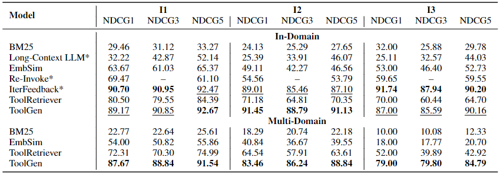
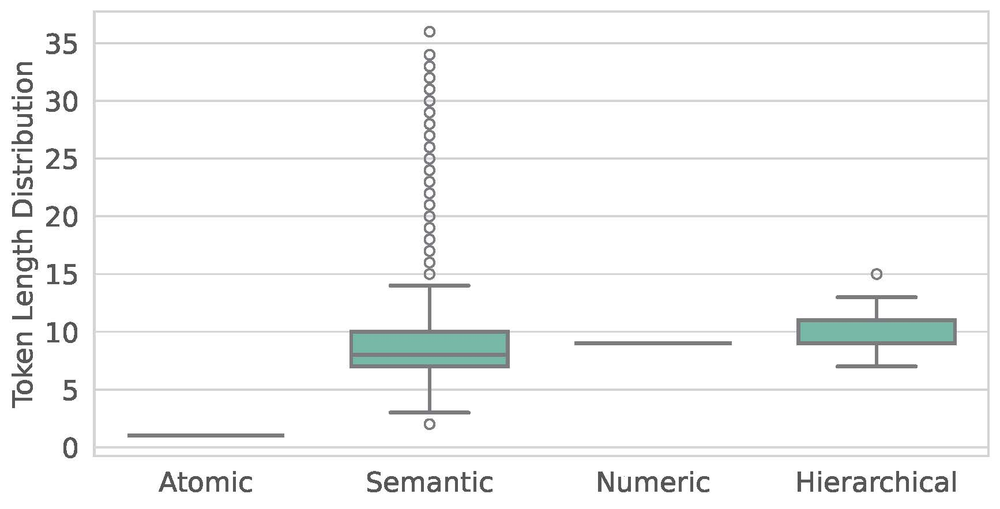
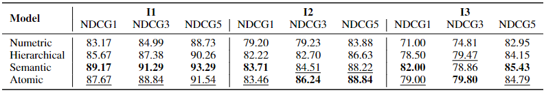
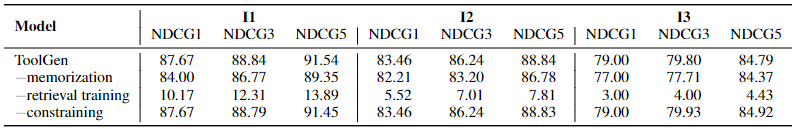
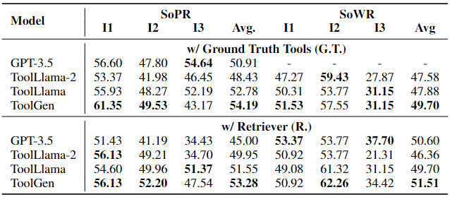
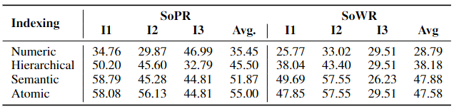
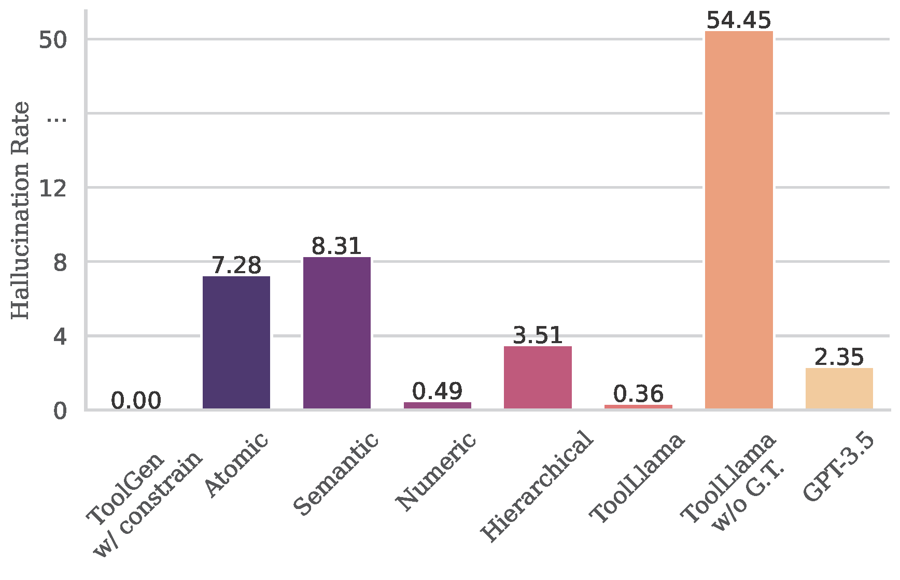

# ToolGen: Unified Tool Retrieval and Calling via Generation

> Renxi Wang, Xudong Han, Lei Ji, Shu Wang, Timothy Baldwin, & Haonan Li (2025). ToolGen: Unified Tool Retrieval and Calling via Generation. In *The Thirteenth International Conference on Learning Representations*.

- Minjae Gwon
  - <minjae.gwon@postech.ac.kr>
  - <https://bxta.kr>
- ML Lab
  - <https://ml.postech.ac.kr>
- CompSec Lab
  - <https://compsec.postech.ac.kr>

---

```yaml
layout: leaflet
```

## Introduction

---

### Background

- Tool calling via APIs
  - Common and effective method for LLM world interaction.
- Common Approach
  - Combine retrieval and execution.
    1. Retrieval Model: Narrows down relevant tools.
    2. LLM: Selects and executes from the narrowed list.

---

### Problem

- Limitations of Combined Approach:
  - Retrieval models (small encoders) may fail to capture complex tool/query semantics.
  - Separating retrieval and execution introduces:
    - Inefficiencies
    - Potential misalignment between stages.
- LLM Knowledge Gap:
  - Pretrained primarily on natural language, lacking intrinsic tool knowledge.
  - Leads to suboptimal performance, especially when relying on retrieved tool descriptions.

---

### Solution: ToolGen

- Integrates real-world tool knowledge directly into LLM parameters.
- Transforms tool retrieval and execution into a single generation task.
- Mechanism:
  - Expands LLM vocabulary with tool-specific virtual tokens.
  - Trains LLM to generate these tokens in context.
  - Leverages LLM's existing knowledge for retrieval and calling.
- Three-Stage Training:
  - Tool Memorization: Associates virtual tokens with tool documentation.
  - Retrieval Training: Learns to generate relevant tool tokens from user queries.
  - Agent Training: Trains model as an autonomous agent (plans, tools, parameters, feedback).

---

### Scenarios

- A tool retrieval task
  - Model retrieves the correct tool for a given query.
- An LLM-based agent task
  - Model completes complex tasks involving real-world API calls.

---

### Contributions

- Integrates tool retrieval and execution into the LLM's generative process using virtual tokens.
In summary, our contributions are:
- Enables efficient and scalable tool retrieval and API calling within ToolGen.
- Demonstrates comparable performance to current best tool retrieval methods with significantly less cost and higher efficiency.

---

```yaml
layout: leaflet
```

## ToolGen

---

### Preliminaries (1)

- Tool learning
  - Aims to resolve a user query $q$
  - Using a large tool set $D = \{d_1, d_2, \ldots, d_N\}$.
    - $|D| = N$ is large, impractical to include all tools in $D$ in the LLM context.
  - Using a retriever $R$ to retrieve $k$ relevant tools from $D$.
    - Denoted as $D_{k,R} = \{d_{r_1}, d_{r_2}, \ldots, d_{r_k}\} = R(q, k, D)$.
    - $|D_{k,R}| \ll N$.

---

### Preliminaries (2)

- Task completion: Iterative process
  - Continues iterating until the final answer $a$ is generated.
    1. Generates a plan $p_i$.
    2. Selects a tool $d_{si}$.
    3. Determines tool parameters $c_i$.
    4. Collects feedback from the tool(s) $f_i$.
- Denoted as $Traj = [q, R(q, D), (p_1, d_{s_1}, c_1, f_1), \ldots, (p_t, d_{s_t}, c_t, f_t), a]$.

---

### Tool Virtualization

- Atomic indexing
  - Each tool is assigned a unique token by expanding the LLM's vocabulary.
  - Embedding for each tool token is initialized as the average embedding of its corresponding tool name.
  - Formally, the token set is defined as $T = {\mathrm{Index}(\mathrm{d})\ |\ \forall d \in D}$
    - Where $\mathrm{Index}$ is the function mapping tools to tokens.

---

### Tool Memorization

$$
\mathcal{L}_{tool} =\sum_{d\in D} -\log p_\theta(\mathrm{Index}(d) | d_{doc})
$$

- Inject tool information by fine-tuning.
  - Input: tool descriptions.
  - Output: corresponding tokens.

---

### Retrieval Training

$$
\mathcal{L}_{retrieval} = \sum_{q\in Q} \sum_{d\in D_q} -\log p_\theta(\mathrm{Index}(d) | q)
$$

- Fine-tune LLM with user queries as inputs and corresponding tool tokens as outputs.
  - Enable LLM to generate tool tokens from user queries.
  - Link hidden space of virtual tool token (and its documentation) to user query space.

---

### End-to-End Agent-Tuning

- Fine-tune LLM with agent task completion trajectories.
  - Inference Strategy (similar to Agent-Flan, not ReAct):
    - Iterative process:
      1. Generate Thought $p$ and corresponding Action token $\mathrm{Index}(d_{s})$.
      2. Fetch tool documentation using the token.
      3. Generate arguments $c$ based on documentation.
      4. Collect feedback $f$.
    - Continues until "finish" token or max turns.
  - Trajectory Format: $Traj = [q, (p_1, \mathrm{Index}(d_{s_1}), c_1, f_1), \ldots, (p_t, \mathrm{Index}(d_{s_t}), c_t, f_t), a]$.

---

### Inference

- Constrained beam search generation
  - LLM may generate action tokens outside the predefined tool token set.
  - Constrained beam search generation restricts output tokens to the tool token set.
  - Applied for both tool retrieval and end-to-end agent system.
  - Significantly reduces hallucination during action generation step.

---

```yaml
layout: leaflet
```

## Tool Retrieval Evaluation

---

### Experimental Setup (1)

- Model
  - Pretrained Llama-3-8B as foundation model.
    - Vocabulary size: 128,256 + 46,985 (expanded) = 175,241.
- Dataset
  - *ToolBench*, a benchmark for tool retrieval.
    - Total: 200k (query, relevant API) pairs.
    - Categories:
      - I1: Single-tool queries (87,413 instances).
      - I2: Intra-category multi-tool queries (84,815 instances).
      - I3: Intra-collection multi-tool instructions (25,251 instances).

---

### Experimental Setup (2)

- Baseline Models
  - *BM25*: A classical unsupervised retrieval method based on TF-IDF.
  - *Long-Context LLMs*: Concatenate tools into a long prompt to gpt-4o
  - *Embedding Similarity*: Sentence embeddings generated using OpenAI's sentence embedding model.
  - *Re-Invoke*: An unsupervised retrieval method with query rewriting and document expansion.
  - *IterFeedback*: BERT-based retriever with iterative feedback for up to 10 rounds.
  - *ToolRetriever*: A BERT-based retriever trained via contrastive learning.

---

### Experimental Setup (3)

- Settings
  - In-Domain Retrieval: Retrieval search space is limited to tools within the same domain.
    - For example, when evaluating queries from domain I1, the search is limited to I1 tools.
  - Multi-Domain Retrieval: Retrieval search space includes tools from all three domains.
    - This setup evaluates the model’s ability to generalize across domains and handle more diverse, complex retrieval cases.
- Metrics
  - Normalized Discounted Cumulative Gain (NDCG)
    - Measures the ranking quality of the retrieved tools.
    - Accounts for both the relevance and ranking poisiton of the retrieved tools.

---

### Results



---

### Indexing Method Comparison (1)

- Explore several alternative generative retrieval approaches.
  - Numeric
    - Map each tool to a unique number.
    - Resulting token is purely numeric, offering no inherent semantic information.
  - Hierarchical
    - Clusters tools into non-overlapping groups and recursively partitions these clusters.
    - The index from the root to the leaf in this tree-like structure represents each tool.
  - Semantic
    - Each tool is mapped to its name.
    - Uses the semantic content of the tool names to guide the LLM.

---

### Indexing Method Comparison (2)



---

### Indexing Method Comparison (3)

- Analysis of the number of subtokens required to represent each tool for the different methods.
  - Atomic indexing ensures each tool to be a single token.
  - Numeric indexing encodes tools into N tokens for tools numbered in $(10^{N-1}, 10^N]$.
  - Hierarchical indexing produces a variable number of subtokens.
  - Semantic indexing has more outliers with significantly longer sequences.

---

### Indexing Method Comparison (4)



- Semantic indexing demonstrates the best retrieval performance.
- Atomic indexing closely follows in many cases.
  - This is attributed to the fact that semantic indexing aligns better with the pretraining data of LLMs.
  - However, this advantage diminishes as the training data and type increase.
  - For example, in the end-to-end agent scenario, atomic indexing achieves better results.

---

### Ablation



- Retrieval training is crucial factor for tool retrieval performance.
- Constrained beam search helps prevent hallucination during action generation.
  - While not a major factor.

---

```yaml
layout: leaflet
```

## End-to-End Evaluation

---

### Experimental Setup (1)

- Dataset
  - Make several modifications to the trajectory data from ToolBench to fit it into ToolGen framework.
  - For example, as ToolGen does not require explicit selection of related tools as input, we remove this information in the system prompt.
- Baselines
  - *GPT-3.5*: `gpt-3.5-turbo-0613` as one of our baselines.
  - *ToolLlama-2*: Fine-tuned Llama-2 model on ToolBench data.
  - *ToolLlama-3*: Fine-tuned Llama-3 model on ToolBench data.
    - In the rest of this paper, we refer to ToolLlama-3 as ToolLlama to distinguish it from ToolLlama-2.

---

### Experimental Setup (2)

- Settings
  - *w/ Ground Truth Tools (G.T.)*: Define ground truth tools for a query as those selected by ChatGPT.
    - For ToolLlama, we directly input the ground truth tools in the prompt.
    - For ToolGen, we add a prefix during the planning phase: `I am using the following tools: [tool tokens]`.
  - *w/ Retriever*: Use a retrieval-based setting.
    - For baselines, we use the tools retrieved by ToolRetriever as the relevant tools.
    - In contrast, ToolGen generates tool tokens directly, so no retriever is used.

---

### Experimental Setup (3)

- Metrics
  - *Solvable Pass Rate (SoPR)*: Percentage of queries successfully solved.
  - *Solvable Win Rate (SoWR)*: Percentage of answers outperforming those generated by a reference model (GPT-3.5 in this study).

---

### Results



- In the G.T. setting,
  - ToolGen achieves the best average SoPR score of 54.19, outperforming GPT-3.5 and ToolLlama, with SoWR also highest for ToolGen at 49.70.
- In the Retriever setting,
  - ToolGen maintains its lead with an average SoPR of 53.28 and SoWR of 51.51.

---

### Indexing Method Comparison



- From the results, we observe that the Atomic method achieves the best performance among the four indexing methods.

---

### Hallucination



- The hallucination rates of generating nonexistent tools across different models are shown.

---

```yaml
layout: leaflet
```

## Conclusion

---

### Summary (1)

- **Introduced ToolGen:**
  - Unifies tool retrieval and execution in LLMs.
  - Embeds tool-specific virtual tokens into the model's vocabulary.
  - Transforms tool interaction into a generative task.
- **Training:**
  - Three-stage process (Memorization, Retrieval, Agent-Tuning).
  - Equips LLMs for efficient retrieval and execution in real-world scenarios.

---

### Summary (2)

- **Impact:**
  - Sets a new benchmark for scalable and efficient AI agents.
  - Capable of handling vast tool repositories.
- **Future Directions:**
  - Integrate advanced techniques (Chain-of-Thought, Reinforcement Learning, ReAct).
  - Further enhance autonomy and versatility of LLMs in real-world applications.

---

```yaml
layout: disclaimer
hideInToc: true
```

# ToolGen: Unified Tool Retrieval and Calling via Generation

> Renxi Wang, Xudong Han, Lei Ji, Shu Wang, Timothy Baldwin, & Haonan Li (2025). ToolGen: Unified Tool Retrieval and Calling via Generation. In *The Thirteenth International Conference on Learning Representations*.

**Disclaimer** This document is intended solely for seminar series within the POSTECH TML. Any use of its contents outside of this context is not endorsed or supported by us. We explicitly disclaim any responsibility for the application or interpretation of the information contained herein beyond our organization's boundaries.

- Minjae Gwon
  - <minjae.gwon@postech.ac.kr>
  - <https://bxta.kr>
- ML Lab
  - <https://ml.postech.ac.kr>
- CompSec Lab
  - <https://compsec.postech.ac.kr>
